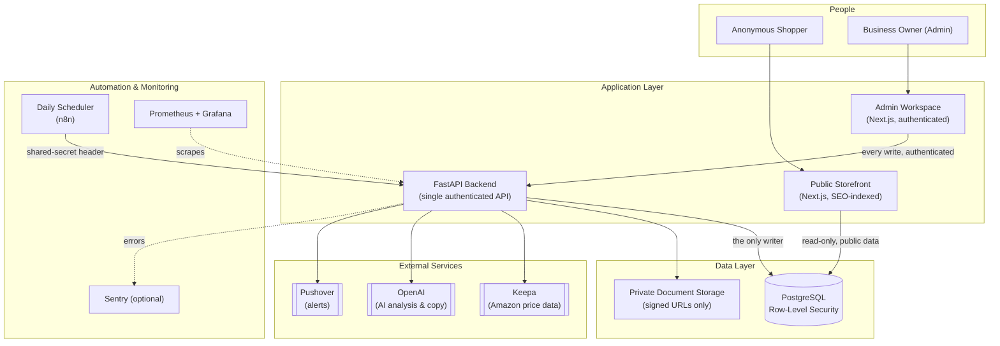
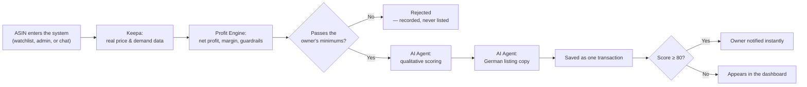

<div align="center">

# Vindera

### Cross-Border AI Arbitrage & Inventory Platform

[](https://github.com/ridvanyigit/vindera-workspace/actions/workflows/ci.yml)


-3ECF8E)

-orange)

**A production-grade, full-stack system that finds, prices, lists, and tracks resale inventory —
end to end, with an AI agent in the loop and a human owner always in control of the money.**

[Overview](#1-overview) ·
[Architecture](#3-system-architecture) ·
[Security](#6-security-compliance--data-handling) ·
[Quality & CI](#7-quality-assurance--reliability) ·
[Documentation](#10-documentation-map) ·
[Setup](#9-getting-started)

</div>

---

## At a Glance

| | |
|---|---|
| **Domain** | Cross-border e-commerce arbitrage (Amazon.de → Willhaben.at), built for a real, operating Austrian small business |
| **What it automates** | Deal discovery, profitability math, AI-assisted listing copy, inventory lifecycle, financial reporting |
| **Architecture** | Decoupled frontend (Next.js) and backend (FastAPI), Postgres with row-level security, background automation, full observability stack |
| **Code quality signals** | 300+ automated backend tests, typed end to end (TypeScript + Pydantic), CI on every push, zero secrets in source control |
| **Current release** | `v3.0.0` — a public, structure-complete **reference snapshot** (see [§8](#8-project-status--versioning)); `v2.8.0` is the last fully configured, production-run release |
| **License** | Proprietary — all rights reserved (see [§11](#11-license--ownership)) |

---

## Table of Contents

1. [Overview](#1-overview)
2. [Core Capabilities](#2-core-capabilities)
3. [System Architecture](#3-system-architecture)
4. [The Business Workflow](#4-the-business-workflow)
5. [Technology Stack](#5-technology-stack)
6. [Security, Compliance & Data Handling](#6-security-compliance--data-handling)
7. [Quality Assurance & Reliability](#7-quality-assurance--reliability)
8. [Project Status & Versioning](#8-project-status--versioning)
9. [Getting Started](#9-getting-started)
10. [Documentation Map](#10-documentation-map)
11. [License & Ownership](#11-license--ownership)
12. [Roadmap](#12-roadmap)
13. [Contact](#13-contact)

---

## 1. Overview

Vindera is a full-stack platform that runs a real cross-border resale business: it watches prices on Amazon.de, decides — with an AI agent, but with the money math done entirely in deterministic code — whether an item is worth buying, drafts a German sales listing for the Austrian marketplace Willhaben, and then tracks that physical unit through its entire life: purchase, inventory, listing, sale or return, and the bookkeeping that follows.

It was built, and runs in production, for one Austrian *Kleinunternehmer* (sole proprietor). Everything in this repository — architecture, data model, testing discipline, security posture, and operational tooling — reflects what a small, real, financially-accountable business actually needs, not a demo.

**Why this project is worth a closer look, if you are evaluating it as an engineering reference:**

- Every dollar figure is computed once, in one place, with `Decimal` arithmetic — never by the AI, never twice.
- The AI is scoped deliberately: it writes prose and produces qualitative scores; it never decides what something is worth.
- The data model enforces its own business rules at the database level (row-level security, append-only ledgers, restricted deletes) — not just in application code.
- The whole system — API, database, and deployment configuration — is covered by continuous integration that runs on every push, without needing a single secret.

---

## 2. Core Capabilities

| Capability | What it does |
|---|---|
| 🔍 **Automated Deal Discovery** | Scans Amazon.de product data (via the Keepa API) for price drops and resale opportunity against a configurable watchlist |
| 🧮 **Deterministic Profit Engine** | Computes net profit, margin, break-even and emergency pricing from the owner's own fee, shipping and VAT numbers — in one auditable module, never estimated by AI |
| 🤖 **AI-Assisted Analysis & Listing Copy** | An AI agent scores demand, competition, risk and seasonality, and drafts German marketplace listings — writing prose, never prices |
| 📦 **Full Inventory Lifecycle** | Every unit is tracked from `pending` through `bought → in_inventory → listed → sold`, including customer returns, with illegal state changes rejected by the backend |
| 📊 **Financial Reporting** | Yearly revenue, cost of goods, gross profit, ROI and VAT-threshold tracking, exportable as accountant-ready CSV |
| 🌐 **Public Storefront** | A public, SEO-indexed storefront for active listings — no customer accounts, no cart, by design |
| ⏱ **Scheduled Automation** | A daily automation run re-scans the watchlist and raises inventory alerts, with no human step required |
| 🔔 **Real-Time Alerts** | Push notifications for high-scoring deals, low API credits, and stock approaching its return deadline |
| 📈 **Built-in Observability** | Structured logs, health checks, and a Prometheus/Grafana stack with pre-built business and system dashboards |

---

## 3. System Architecture

Vindera separates **public, anonymous read access** from **authenticated, financially-consequential writes** at every layer — not just in the UI.



**The one rule that governs everything above:** the browser can never write directly to the database for anything that matters. The public storefront only *reads* a restricted, customer-safe view. Every mutation — creating a deal, recording a sale, changing a status — goes through the authenticated backend, which is the single place that holds the elevated database role. This is enforced in two independent places (the API's own authorization checks, and the database's row-level security policies), so a bug in one layer does not become a breach.

---

## 4. The Business Workflow

A single scan, from a product ID to a tracked, sellable unit:



Once bought, a unit is tracked through its physical life — received, listed, sold or returned — and every sale or refund becomes a permanent, append-only ledger entry that feeds the financial reports. Nothing is ever hard-deleted once money has moved.

---

## 5. Technology Stack

| Layer | Technology | Why it was chosen |
|---|---|---|
| **Frontend** | Next.js 16 (App Router), React 19, TypeScript, Tailwind CSS v4 | Server-rendered SEO pages for the public storefront, a single codebase for both the public site and the admin tool |
| **Backend** | FastAPI, Python 3.14, Pydantic v2 | Typed request/response contracts, async I/O, and a schema the AI's structured outputs validate directly against |
| **Database** | PostgreSQL via Supabase (Auth, Storage, Row-Level Security, Realtime) | A managed Postgres with built-in auth and fine-grained access control, so authorization lives in the database, not only in application code |
| **AI** | OpenAI, structured outputs (`gpt-4o-mini`) | Deterministic, schema-validated model output — not freeform text that application code then has to parse |
| **External Data** | Keepa API | The industry-standard source for historical Amazon.de pricing and demand signals |
| **Automation** | n8n (self-hosted) | Visual, auditable scheduling for the daily scan, independent of the application's own process |
| **Notifications** | Pushover | Reliable, low-latency push alerts for a single operator |
| **Observability** | Prometheus, Grafana, Sentry (optional), structured JSON logs | Metrics, dashboards, and error tracking, all self-hosted and under the project's own control |
| **Infrastructure** | Docker Compose, Caddy (automatic HTTPS), a single EU-based VPS + Vercel | A small, explainable production footprint — no orchestration platform the business doesn't need |
| **CI/CD** | GitHub Actions | Every push runs backend tests, frontend checks, database migrations, and deployment-file validation — with no secrets required |
| **Testing** | pytest, Vitest, SQL smoke tests | Three independent test layers: backend logic, frontend logic, and the database schema itself |

---

## 6. Security, Compliance & Data Handling

| Area | Approach |
|---|---|
| **Authentication** | Supabase-issued bearer tokens for every admin request; a separate, narrowly-scoped shared secret for the one automated system (n8n) that calls the API |
| **Authorization** | Admin status is an explicit allow-list (`admin_users`), checked on every request — being logged in is not, by itself, enough |
| **Defense in depth** | Authorization is enforced twice, independently: once in the API layer, and again by PostgreSQL row-level security. A backend bug cannot, by itself, expose data the database layer still protects |
| **Data isolation** | The public storefront reads from a single, restricted database view that exposes no cost, margin, or internal reasoning — adding a column elsewhere in the schema does not accidentally expose it |
| **Secret management** | No secret is ever committed to source control; local and production configuration are separate files, and the backend refuses to start in production with a missing or weak secret, a wildcard CORS origin, or test data enabled |
| **Document access** | Uploaded invoices live in a private storage bucket; every access is a short-lived (10-minute) signed URL, never a public link |
| **Auditability** | Every change to a deal's status, price or links is recorded automatically in an append-only audit log; financial events (sales, refunds) are themselves an append-only ledger that is never edited or deleted |
| **Error reporting** | Optional Sentry integration strips request bodies, credentials and personal data before an event ever leaves the server |
| **Network exposure** | The database is never reachable from the public internet; monitoring dashboards are bound to localhost and reached only over an SSH tunnel |

---

## 7. Quality Assurance & Reliability

[](https://github.com/ridvanyigit/vindera-workspace/actions/workflows/ci.yml)

Every push and pull request runs the full pipeline below — **with no secrets, against a disposable local database** — before anything can reach `main`:

| Check | What it verifies |
|---|---|
| **Backend test suite** | 300+ automated tests (pytest) against a fully isolated backend — every external service (database, AI, pricing API, notifications) is replaced by an in-memory fake, so a forgotten integration fails the test instead of silently calling a real service |
| **Frontend checks** | Static type checking (TypeScript), linting, unit tests (Vitest), and a full production build |
| **Database migrations** | Every migration is replayed from scratch against a throwaway Postgres instance, followed by two independent SQL-level smoke tests (including a hand-computed financial scenario) |
| **Deployment file validation** | The production Docker Compose files, the reverse-proxy configuration, and the monitoring configuration are all validated for correctness, and the backend's own Docker image is built as a smoke test |

This means the project's **financial logic is tested at the SQL level, not only in application code** — the kind of check a real accounting system needs and a typical CRUD app skips.

---

## 8. Project Status & Versioning

| Version | What it is | Use it if… |
|---|---|---|
| **`v2.8.0`** | The last tag with a fully configured, continuously-deployed production system behind it | …you want to see (or stand up) the application exactly as it runs in production |
| **`v3.0.0`** (current) | A deliberately **structure-complete, dependency-free, secret-free** public snapshot — every module this project ever contained exists as real source code, but installed packages, lockfile-free caches and real credentials were intentionally stripped before this became a public repository | …you want to read, study, or fork the full codebase without needing — or receiving — any of the owner's live infrastructure or credentials |

`v3.0.0` does not run out of the box by design. [`SETUP.md`](./SETUP.md) has the exact, verified steps to turn it back into a running system (reinstall dependencies, provide your own API keys, stand up a local database). Every one of those steps has been run and confirmed to work end to end.

---

## 9. Getting Started

The short version, for a local development environment on macOS or Linux:

```bash
git clone https://github.com/ridvanyigit/vindera-workspace.git
cd vindera-workspace

cp .env.example .env                           # backend configuration
cp frontend/.env.example frontend/.env.local   # frontend configuration

supabase start && supabase db reset --local    # local database
cd backend  && uv sync   && uv run uvicorn src.main:app --reload   # API      → :8000
cd frontend && npm install && npm run dev                          # Frontend → :3000
```

This is the abbreviated path. **[`SETUP.md`](./SETUP.md) is the authoritative, zero-to-running guide** — every prerequisite, every environment variable and where to obtain it, first-admin-user creation, optional automation and monitoring, and a troubleshooting table for the issues people actually hit.

---

## 10. Documentation Map

This README is the starting point. Each audience below has a more detailed document waiting:

| Document | Best for | Contents |
|---|---|---|
| **[`README.md`](./README.md)** (this file) | Anyone evaluating the project | Overview, architecture, security posture, status |
| **[`SETUP.md`](./SETUP.md)** | Developers setting up a local environment | Every prerequisite, every environment variable, step-by-step first run, troubleshooting |
| **[`TECH-DOKUMENTATION.md`](./TECH-DOKUMENTATION.md)** | Engineers and technical reviewers | The complete technical reference: every API endpoint, database table, business rule, and design decision |
| **[`docs/DEPLOY.md`](./docs/DEPLOY.md)** | Whoever operates production | The full production runbook: server provisioning, DNS, secrets, backups, rollback |
| **[`CLAUDE.md`](./CLAUDE.md)** | Contributors and AI coding assistants | House rules this codebase is built and extended by — conventions, invariants, and guardrails |
| **[`LLMOPS-CURRICULUM.md`](./LLMOPS-CURRICULUM.md)** | Readers interested in the applied-AI engineering process | An 11-module, hands-on record of integrating LLM observability, evaluation, guardrails and MLOps tooling against this real codebase |

---

## 11. License & Ownership

This repository has no published open-source license. **All rights are reserved by the project's author.** It is made public as a technical reference and portfolio piece; no permission is granted to use, copy, or deploy this code for any purpose without the author's explicit consent.

---

## 12. Roadmap

- [x] Authenticated API, atomic financial writes, full test suite and CI
- [x] Production deployment, monitoring and backups
- [ ] Live Keepa credit integration for real-time BuyBox ownership
- [ ] Migrate the AI agent chain to a dedicated agentic framework (LangGraph / CrewAI)
- [ ] Move containerized services to a managed cloud platform with Infrastructure-as-Code provisioning

---

## 13. Contact

For questions about this project, please reach out through the author's GitHub profile: **[@ridvanyigit](https://github.com/ridvanyigit)**.

<div align="center">

*Built and operated for a real business. Published as a reference for how it was built.*

</div>
