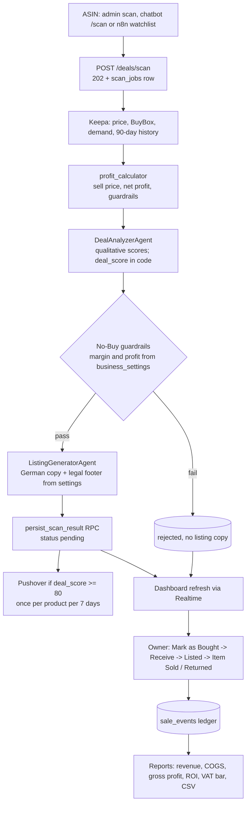
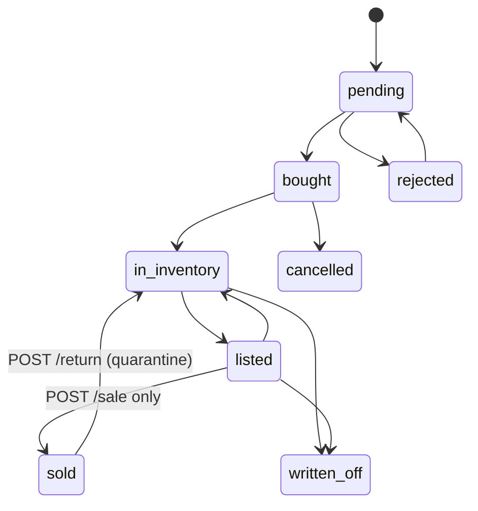

# 🚀 VINDERA — Technical Documentation

> **Cross-Border AI Arbitrage Engine** — finds price gaps between Amazon.de and the Austrian second-hand marketplace Willhaben (Keepa data, AI-assisted scoring), tracks every unit from scan to sale or return, and keeps the books (ledger, reports, VAT threshold) for a one-person Austrian *Kleinunternehmer*.

**Document Version:** 5.0 (`main`, tag `v3.0.0`)
**Last Updated:** 2026-09-30
**Source:** rewritten from the code after Phases 0-8 of `docs/LAUNCH-PLAN.md`, then updated for `v3.0.0`. Where this file and the code disagree, the code wins; `CLAUDE.md` holds the short rules for contributors, `docs/DEPLOY.md` the production runbook, `SETUP.md` the zero-to-running local setup guide.

> ⚠️ **`v3.0.0` is a structural snapshot, not a runnable build.** `backend/.venv`, `backend/uv.lock`, `frontend/node_modules`, `frontend/.next` and `frontend/package-lock.json` were deliberately removed, and every `.env`/`.env.local` file was reset to placeholder values, before this tag was pushed publicly. The **file and folder structure is complete** (every module described in this document exists in the repo, including the optional LLMOps sandbox in §16), but nothing is installed and no real secret is configured. To get a working system again, either follow `SETUP.md` from a clean checkout of this tag (reinstall dependencies, refill `.env`), or check out the last known-working, fully set-up release, `v2.8.0` (`git checkout v2.8.0`) - see the Release Changelog (§17) for exactly what changed since.

---

## Table of Contents

1. [Overview](#1-overview)
2. [Architecture](#2-architecture)
3. [Technology Stack](#3-technology-stack)
4. [Project Directory Structure](#4-project-directory-structure)
5. [Environment Variables](#5-environment-variables)
6. [Backend (FastAPI)](#6-backend-fastapi)
7. [Database (Supabase / PostgreSQL)](#7-database-supabase--postgresql)
8. [Frontend (Next.js)](#8-frontend-nextjs)
9. [Design System & Typography](#9-design-system--typography)
10. [n8n Automation Layer](#10-n8n-automation-layer)
11. [Monitoring / Observability](#11-monitoring--observability)
12. [Run, Test and Deploy Commands](#12-run-test-and-deploy-commands)
13. [Known Limits & Open Items](#13-known-limits--open-items)
14. [Roadmap](#14-roadmap)
15. [`v3.0.0`: draft/structural state](#15-v300-draft-structural-state)
16. [LLMOps / AI Platform Engineering Sandbox](#16-llmops--ai-platform-engineering-sandbox)
17. [Release Changelog](#17-release-changelog)

---

## 1. Overview

| Layer | Technology | Responsibility |
|---|---|---|
| **Frontend** | Next.js 16 (App Router), Tailwind v4 | Public storefront (SEO product pages) and the admin back office (workspace, Product Master, Manual Entry, Reports) |
| **Backend** | FastAPI (Python 3.14, uv) | Authenticated REST API, scan pipeline, profit engine, lifecycle rules, reports, alerts |
| **Database** | Supabase (PostgreSQL, RLS, Storage, Auth) | Products, units, ledger, settings, audit log, private invoice bucket |
| **Automation** | n8n | Daily watchlist scan and inventory alerts |
| **Monitoring** | Prometheus, Grafana, Sentry (optional) | Metrics, alert rules, error tracking |

Each `opportunities` row is **one physical unit**. It lives through `pending → bought → in_inventory → listed → sold` (or `rejected`, `cancelled`, `written_off`), and a customer return puts it back in stock.

### Core end-to-end workflow



---

## 2. Architecture

```
Browser ──> Vercel (Next.js frontend) ──> Supabase (Auth, Postgres, Storage)      reads with the anon/user key, RLS
   │                                            ▲
   └──── HTTPS + Bearer <Supabase access token> │ service role (writes, RPC)
                     ▼                          │
             Caddy (VPS, 80/443) ──> FastAPI backend (ONE uvicorn worker) ──> Keepa, OpenAI, Pushover
                     ├──> n8n  (own owner login)  ── X-Vindera-Key ──> backend
                     └── Prometheus (scrapes /metrics with METRICS_TOKEN) ── Grafana (127.0.0.1, SSH tunnel)
```

- **Write-path rule:** all mutations from the browser go through the backend (service role). The browser's Supabase role can only `SELECT`, plus a column-level `UPDATE` of `opportunities.invoice_url` / `invoice_path` and the file upload into the private `invoices` bucket.
- **Production** (Docker Compose in `infrastructure/prod/`): Caddy, backend, n8n, Prometheus, Grafana on one VPS; the frontend on Vercel; the database on hosted Supabase (EU). Details, DNS, firewall and rollback: `docs/DEPLOY.md`.
- **Local**: everything runs from the workspace root against a local Supabase (`supabase start`); see §12.

---

## 3. Technology Stack

| Area | Choice |
|---|---|
| Frontend | Next.js 16, React 19, Tailwind CSS v4 (no `tailwind.config.js`), recharts, Vitest 5 |
| Backend | FastAPI, Pydantic v2 / pydantic-settings, supabase-py, httpx, slowapi (rate limits), prometheus-client, sentry-sdk (optional), `tzdata`; tests: pytest, pytest-asyncio, respx |
| Database | PostgreSQL 17 on Supabase; SQL functions (RPC), triggers, RLS |
| AI | OpenAI (`OPENAI_MODEL`, default `gpt-4o-mini`), structured outputs |
| Data | Keepa API (Amazon.de, domain 3) |
| Notifications | Pushover |
| Automation | n8n |
| Ops | Docker, Caddy 2.10 (automatic HTTPS), Prometheus 3.5, Grafana 12.2, GitHub Actions |
| LLMOps sandbox (§16, optional) | Langfuse, DeepEval, pgvector, LiteLLM, MLflow, Presidio, Terraform, Kubernetes/Helm/minikube, Ollama, Apache Airflow, OpenTelemetry (concept only) - file/folder structure only, none installed in `v3.0.0` |

---

## 4. Project Directory Structure

```
backend/
  Dockerfile, .dockerignore, pyproject.toml, uv.lock*
  scripts/smoke_auth.sh            end-to-end auth check of a running backend
  scripts/backfill_product_embeddings.py   [sandbox, §16] one-off OpenAI embeddings backfill
  src/main.py                      app factory, middleware, router mounting, startup guards
  src/core/                        config, auth, database, validation, rate_limit, middleware,
                                   logging_config, metrics, sentry, categories,
                                   observability.py [sandbox] Langfuse, pii_guard.py [sandbox] Presidio,
                                   injection_guard.py [sandbox] prompt-injection regex
  src/api/endpoints/               deals.py, expenses.py, reports.py, chat.py, health.py
  src/services/                    profit_calculator, lifecycle, scan_pipeline, keepa_service,
                                   business_settings, inventory_alerts, notification_service, db_util
  src/agents/                      deal_analyzer_agent, listing_generator_agent, chatbot_agent,
                                   second_opinion.py [sandbox, §16] optional local Ollama model
  evals/                           [sandbox, §16] DeepEval + MLflow scripts, never run by `uv run pytest`
  tests/                           conftest.py (isolation), fakes.py (in-memory Supabase), test_*.py, data/,
                                   test_injection_guard.py [sandbox]
frontend/
  src/app/                         /, /product/[id], /impressum, /datenschutz, robots, sitemap, error pages
  src/app/admin/                   page (workspace), products, manual-entry, reports, login, layout
  src/components/                  ProductCard, StoreNav/Footer, CommandBar, Bought/Sale/Return modals, Toast, ScanStatusList, ...
  src/lib/                         apiFetch, profit (preview port), lifecycle, storefront, invoices, legal, constants, ...
  src/lib/__tests__/               Vitest (profit golden vectors, lifecycle helpers)
supabase/
  migrations/                      immutable, timestamped (never edit an applied one);
                                   20260927120000_add_product_embeddings.sql is [sandbox, §16] (pgvector)
  tests/                           phase2_smoke.sql, report_summary_smoke.sql (rolled back)
  scripts/                         cleanup_test_data.sql (manual, NOT a migration)
  seed.sql, config.toml
n8n/                               docker-compose.yml, Vindera_Daily_Scan.json
litellm/                           [sandbox, §16] LiteLLM gateway docker-compose.yml + config.yaml
infrastructure/
  monitoring/                      local Prometheus + Grafana, alerts.yml
  prod/                            docker-compose.yml, Caddyfile, prometheus.yml, .env.prod.example
  backup/                          backup.sh, backup.env.example
  terraform/                       [sandbox, §16] plan-only Hetzner Cloud IaC, never applied
  k8s-sandbox/                     [sandbox, §16] Helm chart for a local minikube cluster
  airflow/                         [sandbox, §16] single-container Airflow + a comparative DAG
.github/workflows/ci.yml           backend, frontend, database, deploy-config jobs (no secrets)
docs/                              LAUNCH-PLAN, LAUNCH-PROGRESS, DEPLOY, MANUEL-ADIMLAR (tr), LAUNCH-CHECKLIST.tr, MANUAL-TEST-SCRIPT (tr),
                                   llmops-mufredat.md [sandbox, §16] full LLMOps curriculum write-up (tr)
SETUP.md                           zero-to-running local setup guide, incl. the sandbox recipes (§16 here mirrors its §17)
```

\* Not present in the `v3.0.0` tag itself - see §15. Regenerate with `cd backend && uv lock`.

---

## 5. Environment Variables

**Backend** (`/.env` locally, `infrastructure/prod/.env.prod` on the server). Template: `.env.example`.

| Variable | Required | Meaning |
|---|---|---|
| `ENVIRONMENT` | no | `development` (default), `test`, `production`. `production` enables the startup guard below |
| `SUPABASE_URL`, `SUPABASE_SERVICE_ROLE_KEY` | yes | Service-role access; never leaves the backend |
| `AUTOMATION_SHARED_SECRET` | prod | n8n header `X-Vindera-Key` (32+ chars in production) |
| `METRICS_TOKEN` | prod | Bearer token for `/metrics` (32+ chars in production) |
| `CORS_ALLOWED_ORIGINS` | prod | Comma-separated frontend origins; no localhost in production |
| `OPENAI_API_KEY`, `OPENAI_MODEL` | optional | Without a key no OpenAI call is made and a scan ends as a failed job |
| `KEEPA_API_KEY` | optional | Same rule for Keepa |
| `PUSHOVER_USER_KEY`, `PUSHOVER_API_TOKEN` | optional | Push notifications |
| `SENTRY_DSN` | optional | Enables Sentry (PII scrubbed) |
| `LOG_LEVEL` | no | `INFO` default |
| `ALLOW_MOCK_DATA` | dev only | `true` allows `[MOCK]` deals without keys; refused in production |
| `RETURN_WINDOW_DAYS`, `SELL_PRICE_POSITION` | no | Defaults 30 and 0.5 (midpoint of today's and the 90-day price) |
| `LANGFUSE_PUBLIC_KEY`, `LANGFUSE_SECRET_KEY`, `LANGFUSE_BASE_URL` | optional, sandbox (§16) | LLM tracing; unset = `init_langfuse()` is a no-op |
| `OPENAI_BASE_URL` | optional, sandbox (§16) | Routes OpenAI calls through a local LiteLLM gateway instead of `api.openai.com` |
| `ENABLE_SECOND_OPINION_MODEL`, `SECOND_OPINION_BASE_URL`, `SECOND_OPINION_MODEL` | optional, sandbox (§16) | Off by default; a local Ollama model's score is logged only, never persisted |

`ENVIRONMENT=production` makes the backend **refuse to start** unless the Supabase URL and key, `AUTOMATION_SHARED_SECRET` and `METRICS_TOKEN` are set (32+ characters), `CORS_ALLOWED_ORIGINS` has no localhost entry and `ALLOW_MOCK_DATA` is false. It also turns off `/docs`, `/redoc` and `/openapi.json`.

**Production-only** (`.env.prod`): `API_DOMAIN`, `N8N_DOMAIN`, `ACME_EMAIL`, `N8N_ENCRYPTION_KEY`, `N8N_IMAGE_TAG`, `GRAFANA_ADMIN_PASSWORD`. Every service gets its own `environment:` list, so n8n and Grafana never see the backend's secrets.

**Frontend** (`frontend/.env.local` locally, Vercel project settings in production; template `frontend/.env.example`): `NEXT_PUBLIC_SUPABASE_URL`, `NEXT_PUBLIC_SUPABASE_ANON_KEY`, `NEXT_PUBLIC_API_URL`, `NEXT_PUBLIC_SITE_URL`. Public by definition: never put a secret in a `NEXT_PUBLIC_*` variable. They are read at build time.

The owner's business numbers (shipping, packaging, fees, minimum margin/profit, VAT threshold, return window, listing texts) are **not** environment variables: they are the single `business_settings` row (60 s cache in the backend).

---

## 6. Backend (FastAPI)

### 6.1 Authentication

- Every `/api/v1/*` route requires `Authorization: Bearer <Supabase access token>` of an account in `admin_users` (`core/auth.py: require_admin`; the token check is cached for 60 s). A valid token of a non-admin gives 403, a bad one 401, an unreachable auth service 503.
- `POST /deals/scan`, `POST /deals/dead-stock/scan`, `GET /deals/watchlist` also accept `X-Vindera-Key: <AUTOMATION_SHARED_SECRET>` (constant-time comparison; `require_admin_or_automation`).
- `/metrics` needs `Authorization: Bearer <METRICS_TOKEN>`. `/healthz` and `/readyz` are the only public routes (no data). In production Caddy additionally answers `/metrics` with 404 from the internet.
- `main.py` calls `assert_routes_protected`: a new `/api/v1` router without an auth dependency stops the app from starting.
- Rate limits (slowapi): chat 20/min, scan 30/min, everything else 120/min per IP, plus a shared 300/min application limit; the client IP comes from `--proxy-headers` behind Caddy.

### 6.2 API endpoints (`/api/v1`)

| Method and path | Auth | Purpose |
|---|---|---|
| `POST /deals/scan` | admin or key | Start a scan for one ASIN; 202 + `job_id` |
| `GET /deals/watchlist` | admin or key | Active ASINs from `watchlist_asins` (used by n8n) |
| `POST /deals/dead-stock/scan` | admin or key | Run the two inventory alerts (dead stock, return deadline) |
| `GET /deals/scans` | admin | Recent scan jobs with outcome and reason |
| `PATCH /deals/{id}/status` | admin | Status change (state machine) and editable fields; illegal move gives 409 |
| `POST /deals/{id}/sale` | admin | Record a sale in the ledger; the backend computes the profit |
| `POST /deals/{id}/return` | admin | Customer return: refund event, unit back in stock in quarantine |
| `DELETE /deals/{id}` | admin | Soft delete (`deleted_at`); refused (409) for a unit with a sale |
| `POST /deals/manual`, `PUT /deals/{id}/manual` | admin | Manual entry through the atomic RPCs (quantity 1-50 creates suffixed SKUs) |
| `GET /reports/summary?year=` | admin | Yearly report (`report_summary` SQL function) |
| `GET /reports/export.csv?year=` | admin | CSV for the Steuerberater (UTF-8 BOM, `;`, decimal comma, formula-safe) |
| `POST/GET/PUT/DELETE /expenses/` | admin | Business expenses |
| `POST /chat/` | admin | Chatbot (`/list`, `/scan`, `/help`, natural language). It **cannot delete** anything |
| `GET /healthz`, `GET /readyz` | public | Liveness; database reachability (503 when down) |
| `GET /metrics` | metrics token | Prometheus |

Errors from the SQL functions are mapped by `services/db_util.call_rpc`: `22023` gives 422, `P0002` 404, `55000` 409, `23505` 409. Validation (`core/validation.py`) checks ASIN format, status values, numeric bounds and https/willhaben URLs.

### 6.3 Scan pipeline (`services/scan_pipeline.py`)

At most 2 scans run at once; each one is a `scan_jobs` row that ends as `succeeded | rejected | failed` with a readable reason (dashboard: AI Terminal → **Scans**).

1. **Keepa** (`services/keepa_service.py`): `stats=90, history=1, buybox=1, days=90, domain=3`. Buy price = BuyBox, else Amazon, else 3rd-party new; reference = 90-day BuyBox average (fallbacks: Amazon, then new). Real daily price points are stored. HTTP 429/503 means "tokens exhausted": the job fails with `retry_after` and one Pushover per day. 3 attempts with backoff.
2. **Profit** (`services/profit_calculator.py`): sell price = midpoint of today's price and the 90-day price (`SELL_PRICE_POSITION`).
3. **DealAnalyzerAgent**: qualitative scores only (clamped to 0-10 in code); `deal_score` is computed in code, demand is capped at 5 without Keepa demand data, risk at 3 for a seller that is neither Amazon nor FBA.
4. **ListingGeneratorAgent**: German Willhaben copy; the payment line and the legal footer are appended **verbatim from `business_settings`**; the model never sees buy price and never writes legal wording. Rejected deals get no listing.
5. **`persist_scan_result` RPC**: one transaction for product, price history, opportunity and listing. Scanning the same ASIN again refreshes its single open row.
6. **Pushover** for hot deals (score >= 80), once per product per 7 days.

A Keepa or OpenAI failure fails the job and writes nothing. There is no mock fallback outside `ALLOW_MOCK_DATA=true`. Jobs left `queued`/`running` by a restart are closed at startup.

### 6.4 Profit engine (one place for all money math)

`backend/src/services/profit_calculator.py` (Decimal; every amount rounded to cents, half away from zero, before the next step):

```
total_cost     = purchase_price + inbound_shipping + packaging
platform_fees  = sell_price * platform_fee_pct / 100 + platform_fee_fixed
payment_fees   = sell_price * payment_fee_pct / 100
return_reserve = sell_price * return_reserve_pct / 100
net_profit     = sell_price - total_cost - outbound_shipping - platform_fees - payment_fees - return_reserve
net_margin_pct = net_profit / total_cost * 100          (margin on COST)
```

- **No-Buy guardrail:** net margin >= `min_net_margin_pct` AND net profit >= `min_net_profit_eur` (both from `business_settings`; equal passes).
- **Break-even price**, **emergency price** (85 % of target, never below break-even; only lifted, never lowered, when cost or target changes) come from the same module.
- **Actual profit** of a sale uses the recorded sale amounts and the effective cost of the unit; a cost that was never recorded counts as zero (same rule as the report).
- `frontend/src/lib/profit.ts` is a preview-only port. Both are tested against `backend/tests/data/profit_golden_vectors.json`; the backend recomputes and stores its own figures on every save and never trusts a client-sent profit.
- Effective unit cost = `coalesce(purchase_price_actual, buy_price) + inbound_shipping_cost + packaging_cost` (SQL: `effective_total_cost(o)`).

### 6.5 Lifecycle, ledger and alerts



- `services/lifecycle.py` is the only place that defines transitions (illegal gives 409; status changes are compare-and-set). `sold` is reached only through `POST /deals/{id}/sale`; `POST /deals/{id}/return` reverses it in the ledger.
- Sales and refunds are rows of the **append-only `sale_events` ledger** (UPDATE/DELETE/TRUNCATE raise). A unit with a sale is never deleted; a product row is never deleted. All reads exclude `deleted_at IS NOT NULL`.
- `return_by` = purchase date + `return_window_days`. `services/inventory_alerts.py` (called by `/dead-stock/scan`) sends one Pushover per unit for stock older than 60 days and for units whose return window closes within 5 days.
- Status, price and link changes are recorded in `audit_log` by trigger.

### 6.6 Reports

`GET /reports/summary` calls the SQL function `report_summary(year)`: revenue = sales minus refunds by **Europe/Vienna** calendar year; COGS = effective cost of sold units (reversed by a refund); gross profit; expenses; before-tax result; ROI = gross profit / COGS; VAT-threshold percentage = year revenue / `vat_threshold_eur`; a cash (E/A) view by purchase date. The cash view is a management aid, not tax advice. `GET /reports/export.csv` is the same data for the Steuerberater.

### 6.7 Observability

JSON logs on stdout with a request id (`X-Request-Id`), secrets masked, request bodies never logged, `httpx` logging capped at WARNING (Keepa's key travels in the query string). A middleware turns unexpected errors into a JSON 500 with the request id and reports to Sentry. Prometheus metrics: `vindera_scan_jobs_total`, `vindera_keepa_tokens_left`, `vindera_openai_errors_total`, plus the standard HTTP metrics; alert rules in `infrastructure/monitoring/alerts.yml` (BackendDown, HighServerErrorRate, ScanJobsFailing, KeepaTokensLow, OpenAIErrors). **Metrics are per process: run exactly one uvicorn worker.**

---

## 7. Database (Supabase / PostgreSQL)

### 7.1 Tables

| Table / view | Purpose |
|---|---|
| `products` | One row per ASIN (title, category, images, Keepa figures). Never deleted |
| `opportunities` | One row per physical unit: status (CHECK constraint), prices, purchase record, return-by, SKU (unique), invoice, Willhaben URL, `deleted_at`, quarantine flag |
| `price_history` | Real Keepa price points (unique per product and timestamp) |
| `generated_listings` | German ad copy per unit |
| `sale_events` | Append-only ledger of sales and refunds |
| `business_settings` | The single settings row (fees, shipping, minimums, VAT threshold, texts) |
| `scan_jobs` | One row per scan with outcome and reason |
| `watchlist_asins` | ASINs the daily n8n run scans (`active` flag) |
| `business_expenses` | Costs not tied to a deal |
| `events_calendar` | Seasonal events used by the AI prompt |
| `audit_log` | Trigger-written history of status, price and link changes |
| `admin_users` | Who may use the admin API (RLS on, no policies: invisible to browsers) |
| `storefront_listings` (view) | The only thing the public storefront reads |

Functions: `is_admin()` (SECURITY DEFINER), the atomic writers `persist_scan_result`, `create_manual_deal`, `update_manual_deal`, `record_sale`, `record_return` (executable by `service_role` only; payload keys documented in `20260921091100_atomic_write_functions.sql`), `report_summary(year)`, `effective_purchase_price(o)`, `effective_total_cost(o)`.

### 7.2 Access model

- `authenticated` (the browser) has SELECT only, plus column-level UPDATE of `opportunities.invoice_url` / `invoice_path`. `anon` reads only `storefront_listings`.
- `storefront_listings` shows only `in_inventory` / `listed` units that are not quarantined and not soft-deleted, with customer-safe columns (no buy price, margin or thesis). Adding a column to a table does **not** expose it.
- DB guards: sold units and units with sale events cannot be hard- or soft-deleted; products and units are `ON DELETE RESTRICT`; `sale_events` is append-only.
- Storage: bucket `invoices` is **private** (PDF/images, size limit); files are opened through 10-minute signed URLs (`frontend/src/lib/invoices.ts`). Legacy public invoice links are recovered to signed URLs ("View Invoice (legacy)").
- Realtime: `opportunities` is in the publication; the dashboard refreshes after a background scan.

### 7.3 Migrations and tests

- `supabase/migrations/` is append-only history: **never edit an applied migration**. `supabase db reset --local` rebuilds everything from scratch (CI does this on every push). Pushing to the hosted project (`supabase db push`) is a manual owner step after a backup (`docs/MANUEL-ADIMLAR.md`).
- `supabase/tests/phase2_smoke.sql` (115 checks) and `report_summary_smoke.sql` (21 checks, hand-computed scenario) run inside a rolled-back transaction.
- `supabase/scripts/cleanup_test_data.sql` is a manual, guarded clean-up for test rows; it is not a migration and never runs automatically.

---

## 8. Frontend (Next.js)

### 8.1 Routes

| Route | Rendering | Auth |
|---|---|---|
| `/` | Client component (rails, category grids, search) | none (anon) |
| `/product/[id]` | **Server component** (metadata, Open Graph, Product JSON-LD, `notFound()`, `revalidate = 60`) | none |
| `/impressum`, `/datenschutz` | Static; owner data in `src/lib/legal.ts` (no legal wording written by software) | none |
| `/robots.txt`, `/sitemap.xml` | Generated from `NEXT_PUBLIC_SITE_URL` and `storefront_listings` | none |
| `/admin` | Workspace: deal explorer, deal inspector, dashboard + AI terminal + Smart Radar | admin |
| `/admin/products` | Product Master: searchable, resizable table, paging, CSV | admin |
| `/admin/manual-entry` | Enter or edit a complete deal (profit preview, purchase record, quantity) | admin |
| `/admin/reports` | Yearly reports, VAT bar, expenses, CSV export | admin |
| `/admin/login` | Sign-in | none |

Admin pages are `noindex`, need the `vindera-admin` root class and the dark/light toggle (`useDarkMode`), and sit behind the Supabase session plus `is_admin()`.

### 8.2 Calling the backend

`src/lib/apiFetch.ts` attaches the access token, signs the user out on 401 and throws readable errors (Pydantic prefixes are stripped). Failures show as toasts (`Toast.tsx`) or inside the open modal. Lifecycle actions use `BoughtModal`, `SaleModal` and `ReturnModal`; the modals show a preview computed with `src/lib/profit.ts`, the backend stores its own numbers. Product photos are pasted-in https URLs, shown through `ListingImage` (`next/image` with `unoptimized`, so `/_next/image` cannot become an open proxy). Security headers and a CSP are set in `next.config.ts`.

### 8.3 Storefront

Anonymous, no accounts, no cart. "Buy" opens the live Willhaben ad; without a Willhaben URL the button is disabled ("Bald verfügbar"). Rails are built from the newest 60 listings; category pages page by 24. Sold, quarantined and deleted units are not visible; a product page for one of them shows a friendly 404.

### 8.4 Workspace terminal

`CommandBar.tsx` is the embedded terminal: `/list`, `/scan <ASIN>`, `/help` and natural language through `POST /chat/`. There is no delete command. The "Scans" button opens `ScanStatusList` (last scans and why one failed).

### 8.5 Austria Market Calendar (`src/components/AustriaCalendarModal.tsx`, `src/lib/austriaCalendar.ts`)

Opened from the calendar icon in the AI Smart Radar header. A month grid (Monday first) with category filter chips, a detail panel for the selected day and a "Key dates ahead" list. Escape or a backdrop click closes it.

- **Prominent closures:** the 13 statutory Austrian public holidays and Sundays are marked red and flagged "Shops closed". Bridge days (*Fenstertage*), regional state holidays and Good Friday (not a public holiday in Austria) are shown separately.
- **Computed for any year** (`getCalendarItems(years)`): movable holidays from the Gregorian Easter algorithm, bridge days, Black Friday (Friday after the 4th Thursday of November), Black Week, Cyber Monday, Mother's/Father's Day, Valentine's Day, Halloween, first Advent and approximate Urlaubsgeld / Weihnachtsgeld payout dates (marked "ca.", they vary by collective agreement).
- **Curated data** (`STATIC_ITEMS`, researched Sep 2026, covering Sep 2026 – Sep 2027): school terms and holidays per federal state (bmb.gv.at), Amazon Prime Deal Days, ÖFB / Wiener Derby football, ski races (Sölden, Kitzbühel, Schladming), Vienna City Marathon, Formula 1 Austria (Spielberg), festivals (Nova Rock, Donauinselfest, Frequency), Christkindlmärkte and selected concerts. Each item carries an *impact* rating (high / medium / low) — a heuristic estimate of the effect on resale demand, not a measured value.
- **Independent of the database:** the calendar is static frontend data and deliberately **not** merged into `events_calendar`, so the radar's "Next:" badge and the AI seasonality prompt are not flooded with holidays. **Refresh `STATIC_ITEMS` once a year.**
- **Known gaps:** no confirmed 2027 stadium concerts were found; Post Christmas shipping cut-off dates are omitted (no reliable 2026 source); the Wiener Derby date may still shift.

### 8.6 Reports page (`src/app/admin/reports/page.tsx`)

Reads only the backend (`/reports/summary`, `/expenses/`): year selector (only years with data), management view and cash (E/A) view, VAT-threshold bar (indigo, amber from the warning percentage, red near the limit), business expenses (description, amount, category, date, recurring label) and **Export CSV**. Errors show a banner with Retry instead of silent zeros.

---

## 9. Design System & Typography

Typography is centralized in `src/app/globals.css` and loaded in `src/app/layout.tsx`. No page defines its own font family.

- **UI typeface:** Inter, loaded via `next/font/google` as `--font-inter` and exposed to Tailwind as `--font-sans`.
- **Mono typeface:** JetBrains Mono as `--font-jetbrains-mono` → `--font-mono`, used for SKU, ASIN and slash commands.
- **Rendering:** antialiasing, `optimizeLegibility`, and Inter alternate glyph features (`cv02`–`cv11`).
- **Tabular figures:** all tables and any element with `tabular-nums` use fixed-width digits so prices and scores do not jitter between renders.

### Type scale (CSS custom properties)

| Token | Size | Tracking | Usage |
|---|---|---|---|
| `--text-display` | 28px | −0.025em | Login headline |
| `--text-title` | 22px | −0.02em | Page titles, KPI figures |
| `--text-heading` | 17px | −0.015em | Large inline values |
| `--text-subheading` | 15px | −0.015em | Card / section headings |
| `--text-body` | 14px | −0.006em | Default body |
| `--text-small` | 13px | −0.006em | Secondary copy, table cells |
| `--text-caption` | 12px | — | Captions |
| `--text-label` | 11px | +0.06em | Uppercase eyebrow labels |

### Semantic component classes

| Class | Applied to |
|---|---|
| `.type-page-title` | One per route: deal title, "Products", "Tax & Financial Reports" |
| `.type-section-title` | Card and modal headings |
| `.type-label` | Panel headers, table headers, uppercase eyebrows |
| `.type-metric` | KPI numbers (tabular figures) |
| `.type-body` | Paragraph copy in detail panels |

Weights are capped at `600` (semibold); `font-extrabold` is no longer used anywhere in the codebase.

### Dark Mode

Dark mode uses a **class-based** strategy: toggling `.dark` on `<html>` (Tailwind v4's `@custom-variant dark (&:where(.dark, .dark *))` in `globals.css`).

**Scope isolation:** All CSS overrides are nested under `.dark .vindera-admin { ... }` so the public storefront is completely unaffected. Every admin page (`/admin`, `/admin/products`, `/admin/manual-entry`, `/admin/reports`) puts `vindera-admin` on its root element and mounts the toggle via `useDarkMode()`; `globals.css` has extra rules for the page root itself (its own background/text, `color-scheme: dark` for native controls) and for the additional colour families those pages use.

**Color palette (GitHub Dark inspired):**

| Light class | Dark value |
|---|---|
| `bg-white` | `#161b22` |
| `bg-gray-50` | `#0d1117` |
| `bg-gray-100` | `#21262d` |
| `text-gray-900` | `#e6edf3` |
| `text-gray-500` | `#6e7681` |
| `border-gray-200` | `#30363d` |
| `bg-indigo-50` | `#1e1b4b` |
| `text-indigo-600` | `#818cf8` |

**`/admin/login` approach:** Uses direct `dark:` Tailwind variants (light-default + `dark:` override) rather than the scoped `.vindera-admin` CSS block, because the login page is standalone.

**Hook — `src/lib/useDarkMode.ts`:** reads the `vindera-theme` key of `localStorage` (fallback: `prefers-color-scheme`) through `useSyncExternalStore` with a light server snapshot, so the first client render matches the server HTML (no hydration error); it keeps an in-memory fallback when storage is blocked, and syncs the `.dark` class on `<html>`.

---

---

## 10. n8n Automation Layer

`n8n/docker-compose.yml` (local) and the `n8n` service of `infrastructure/prod/docker-compose.yml` (production, behind Caddy at `https://n8n.<domain>`, own owner login).

`n8n/Vindera_Daily_Scan.json` — **Vindera Daily Auto-Scan**, daily at 08:15 (Europe/Vienna):

```
Schedule Trigger
  → Fetch Watchlist (GET /api/v1/deals/watchlist)
  → Split Watchlist
  → POST /api/v1/deals/scan            (one call per ASIN, 202)
Schedule Trigger
  → POST /api/v1/deals/dead-stock/scan (dead stock + return-deadline alerts, 202)
```

Authentication is a n8n **Header Auth** credential named `Vindera Automation Key` (`X-Vindera-Key` = `AUTOMATION_SHARED_SECRET`); the file itself contains no secret. The base URL comes from the `VINDERA_API_BASE_URL` environment variable (default `http://host.docker.internal:8000`). Which ASINs are scanned is the `watchlist_asins` table, not the workflow. After changing the JSON, re-import it in n8n.

---

## 11. Monitoring / Observability

- **Local** (`infrastructure/monitoring/`): Prometheus `:9090` and Grafana `:3002`, both bound to `127.0.0.1`; `GRAFANA_ADMIN_PASSWORD` is required. Prometheus scrapes the backend `/metrics` with the bearer token from `infrastructure/monitoring/secrets/metrics_token` (git-ignored).
- **Production** (`infrastructure/prod/`): Prometheus publishes no port; its token is written from `METRICS_TOKEN` at start. Grafana listens on `127.0.0.1:3002` of the VPS (SSH tunnel); provisioned data source in `grafana/datasources.yml`.
- **Health**: `/healthz`, `/readyz` (UptimeRobot on `/healthz`). **Errors**: optional Sentry for the backend (the frontend has no error tracking yet). **Alerts** fire inside Prometheus; sending them somewhere needs Alertmanager (backlog).
- **Backups**: `infrastructure/backup/backup.sh` (pg_dump of `public` + `auth`, verified, optional `age` encryption, 30-day retention, optional ping URL). Storage files are not included. Restore procedure: `docs/DEPLOY.md`.

---

## 12. Run, Test and Deploy Commands

> As of `v3.0.0` (§15), none of the commands below work on a fresh checkout of this tag until dependencies are reinstalled: `cd backend && uv sync` and `cd frontend && npm install` first. Full step-by-step instructions (prerequisites, every env var, first-admin creation): `SETUP.md`.

```bash
# Run (from the workspace root)
cd backend && uv run uvicorn src.main:app --reload         # API      :8000
cd frontend && npm run dev                                  # Frontend :3000
supabase start                                              # local Supabase (never link it to the hosted project by accident)
cd n8n && docker compose up -d                              # n8n      :5678
cd infrastructure/monitoring && docker compose up -d        # Grafana  :3002 (needs GRAFANA_ADMIN_PASSWORD)

# Test (no network, no real Supabase/Keepa/OpenAI/Pushover, never reads /.env)
cd backend && uv run pytest -q
cd frontend && npx tsc --noEmit && npm run lint && npm test && npm run build
supabase db reset --local
docker exec -i supabase_db_vindera-workspace psql -U postgres -v ON_ERROR_STOP=1 < supabase/tests/phase2_smoke.sql
docker exec -i supabase_db_vindera-workspace psql -U postgres -v ON_ERROR_STOP=1 < supabase/tests/report_summary_smoke.sql

# Deploy: docs/DEPLOY.md (VPS: docker compose in infrastructure/prod; frontend: Vercel; migrations: supabase db push by the owner after a backup)
```

| Service | Address | Credentials |
|---|---|---|
| Frontend | `http://localhost:3000` | Supabase login of an `admin_users` account |
| Backend API | `http://localhost:8000` | Bearer token (or `X-Vindera-Key` for the automation routes); `/healthz` is open |
| Prometheus | `http://localhost:9090` | none (loopback only) |
| Grafana | `http://localhost:3002` | `admin` / `GRAFANA_ADMIN_PASSWORD` |
| n8n | `http://localhost:5678` | owner account created on first run |

CI (`.github/workflows/ci.yml`) runs all of this without any secret: backend tests, frontend checks, a local Supabase with both SQL smoke tests, and the deployment-file checks (compose config, Caddy validate, promtool, shellcheck, image build).

---

## 13. Known Limits & Open Items

1. **Keepa response shape** was implemented from Keepa's official client sources and has not been checked against a live answer. The first real scan must confirm it (see `docs/LAUNCH-CHECKLIST.tr.md`): especially `stats.avg90[18]` (90-day BuyBox average) and the price history.
2. **Price history chart** shows real Keepa points; with fewer than 2 points it shows a deterministic sample curve labelled "Sample". Old scans (before the pipeline rewrite) left fabricated points (`MANUEL-ADIMLAR.md`).
3. **Category list** exists twice: `backend/src/core/categories.py` (`CANONICAL_CATEGORIES`) and `frontend/src/lib/constants.ts` (`PRODUCT_CATEGORIES`). Update both together; no automated check.
4. **Austria market calendar** (§8.5) `STATIC_ITEMS` cover Sep 2026 - Sep 2027 only; refresh yearly.
5. **Tests do not cover**: the chatbot's OpenAI tool loop, frontend components (only pure helpers), the workflows on GitHub before their first run. The deployment files were verified locally only, never on a real server.
6. **Alerts** stay inside Prometheus (no Alertmanager); the "Keepa tokens exhausted" push is deduplicated in memory (a restart can repeat it once).
7. The German copy in `ListingGeneratorAgent` is intentional (published Willhaben text); do not translate it. Legal wording is the owner's lawyer's job, not software's.
8. **`v3.0.0` does not run out of the box** - dependencies and secrets were intentionally stripped before making the repository public. See §15.

---

## 14. Roadmap

Post-launch backlog (not started): Keepa Deals/Tracking webhooks for discovery beyond the watchlist, Willhaben comparable-price research, a watchlist admin UI, recurring expenses, multi-quantity lots as a concept, Willhaben-to-Vindera sale sync, agent framework migration, Alertmanager routing, frontend Sentry, i18n.

---

## 15. `v3.0.0`: draft/structural state

`v3.0.0` exists to make this repository's **full, complete structure** - every module ever built on it, including the exploratory ones below - publicly visible and readable, without publishing a single real credential or a large, disposable, machine-specific cache. It is **not a working deployment** and was never intended to be one.

**What was deliberately removed before tagging:**

| Removed | Size | Regenerate with |
|---|---|---|
| `backend/.venv` | ~27M | `cd backend && uv sync` |
| `backend/uv.lock` | ~184K | `cd backend && uv lock` |
| `frontend/node_modules` | ~85M | `cd frontend && npm install` |
| `frontend/.next` | ~8.6M | `npm run dev` / `npm run build` |
| `frontend/package-lock.json` | ~284K | `npm install` |

**What was reset to placeholders** (every value like `here_your_openai_api_key`, never a real secret): the root `.env`, `frontend/.env.local`, `infrastructure/monitoring/.env`. `.env.example` (root), `frontend/.env.example` and `infrastructure/monitoring/.env.example` are the templates - copy and fill them in (also see `SETUP.md` §4).

**To get a working system again, pick one:**

1. **Set this tag up from scratch** (recommended if you want the LLMOps sandbox structure too): check out `v3.0.0`, follow `SETUP.md` start to finish - install prerequisites, `uv sync`, `npm install`, `supabase start` + `db reset --local`, fill in every `.env` with your own real keys, create your first admin user.
2. **Go back to the last fully working, already-configured release** (if you just want the running application, without the sandbox modules): `git checkout v2.8.0`. That tag predates all of §16 below and has none of this stripping - it is the last tag that was a genuinely deployable snapshot on its own branch history.

---

## 16. LLMOps / AI Platform Engineering Sandbox

An 11-module, hands-on LLMOps/AI-Platform-Engineering curriculum was built directly on top of this codebase, one tool at a time, each wired into a real (sandboxed) part of Vindera and verified with real commands. **Every file below exists in the repository as of `v3.0.0`**, but none of the packages, containers, clusters or models it depends on are installed - this section documents structure, not a running feature. The complete, original teaching write-up (every real terminal output, every mistake made and fixed, concept dictionaries), in the Turkish it was taught in, lives in this repo at `docs/llmops-mufredat.md` and, as the durable original, at the [Claude Docs artifact](https://claude.ai/code/artifact/82c93842-c385-4045-b7b5-9d1ad351af75) it was authored in. `SETUP.md` §17 has the exact install/run/verify/clean-up commands for each module below, condensed from that write-up.

| Module | Tool(s) | Files in this repo | Wired into |
|---|---|---|---|
| 1. LLM Observability | Langfuse | `backend/src/core/observability.py` | `main.py` (`init_langfuse()`), both agents' OpenAI calls (monkey-patched) |
| 2. LLM Evaluation | DeepEval | `backend/evals/{fixtures,metrics,check_listing_generator,report_to_confident_ai}.py` | Standalone; never run by `uv run pytest` |
| 3. Vector Database | pgvector | `supabase/migrations/20260927120000_add_product_embeddings.sql`, `backend/scripts/backfill_product_embeddings.py` | `products.embedding` + `match_similar_products()` RPC |
| 4. LLM Gateway | LiteLLM | `litellm/{docker-compose.yml,config.yaml,config.fallback-demo.yaml}` | `OPENAI_BASE_URL` in `config.py`, both agents |
| 5. Experiment Tracking | MLflow | `backend/evals/compare_prompts_mlflow.py` | `listing_generator_agent.py`'s `DEFAULT_SYSTEM_PROMPT` / `system_prompt_override` |
| 6. Guardrails & PII | Presidio | `backend/src/core/pii_guard.py`, `backend/src/core/injection_guard.py`, `backend/tests/test_injection_guard.py` | `scan_pipeline.py` (input guardrail), `evals/metrics.py`'s `NoPIIMetric` (output guardrail), `vindera_prompt_injection_blocked_total` metric + `PromptInjectionBlocked` alert |
| 7. Infrastructure as Code | Terraform | `infrastructure/terraform/{main.tf,variables.tf,outputs.tf,terraform.tfvars.example}` | Plan-only; matches `docs/DEPLOY.md`'s real server spec |
| 8. Kubernetes | minikube + Helm | `infrastructure/k8s-sandbox/vindera-backend/` | Sandbox only; production still uses `infrastructure/prod/`'s docker compose |
| 9. Model Serving | Ollama | `backend/src/agents/second_opinion.py` | `scan_pipeline.py`, logged only, never affects a saved deal |
| 10. Pipeline Orchestration | Apache Airflow | `infrastructure/airflow/{docker-compose.yml,dags/vindera_daily_scan.py}` | Comparative to `n8n/Vindera_Daily_Scan.json`; n8n's production workflow is untouched |
| 11. Capstone | OpenTelemetry | (none - concept only) | Documented in `SETUP.md` §17 as a future exercise |

None of this changes the production write-path rule, the profit engine, or any endpoint's authentication - every module above is either fully optional (off by default, e.g. `ENABLE_SECOND_OPINION_MODEL=false`) or lives entirely outside the request path the real application uses (evals, IaC, a separate sandbox cluster).

## 17. Release Changelog

| Tag | Date | Summary |
|---|---|---|
| `v3.0.0` | 2026-09-30 | **Public, structural-only release.** Every module ever built on this codebase (launch-hardening + the 11-module LLMOps sandbox, §16) now exists as real files, but `.venv`/`node_modules`/`.next`/both lockfiles are removed and every `.env` is placeholder-only - **this tag does not run as-is**. To get a working system: follow `SETUP.md` on this tag (reinstall + refill secrets), or `git checkout v2.8.0` for the last fully working, already-configured snapshot. See §15 for the full detail. |
| `v2.8.0` | 2026-09-22 | Last fully working, deployable snapshot before the `v3.0.0` public-release cleanup. |
| `v2.7.1` | 2026-09-21 | Launch hardening. The small "WORKSPACE" caption under the logo is removed from Product Master, Manual Entry and Tax & Reports. Authenticated API, atomic SQL writers, sale ledger, one profit engine, lifecycle state machine, reports and CSV, private invoices, storefront SEO, observability, tests and CI, production deployment files. 13 migrations applied to the hosted project by the owner on 2026-09-21 |
| `v2.7.0` | 2026-09-20 | Click-to-minimize on dashboard panels; documentation update |
| `v2.6.0` | 2026-09-20 | Austria market calendar in the AI Smart Radar header |
| `v2.5.0` | 2026-09-20 | Dead-stock Pushover notification; business expenses; dark/light toggle on Product Master and Manual Entry |
| `v2.4.0` | 2026-09-20 | Dark/light mode on `/admin` and `/admin/login` |
| `v2.3.0` | 2026-09-18 | Customer accounts removed; nothing is purchasable on Vindera |
| `v2.1.0` | 2026-09-17 | Homepage as scrollable product rails |
| `v2.0.0` | 2026-09-16 | Split into public storefront and admin back office |

---
*Documentation compiled and maintained for the Vindera workspace repository.*
