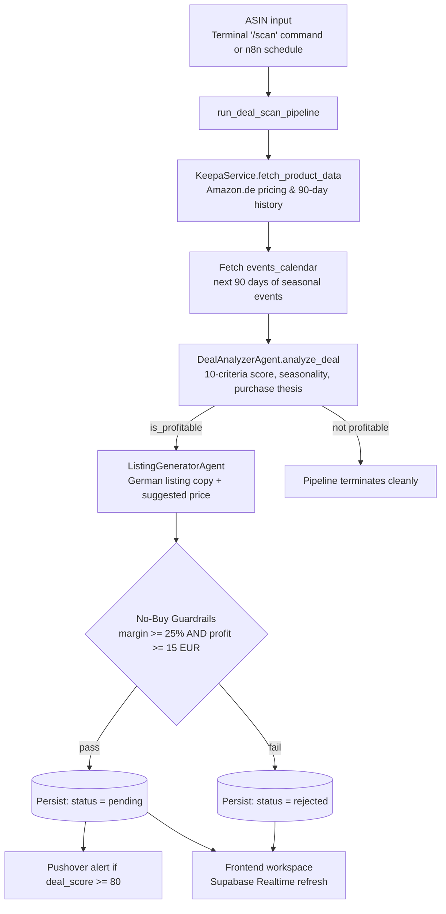
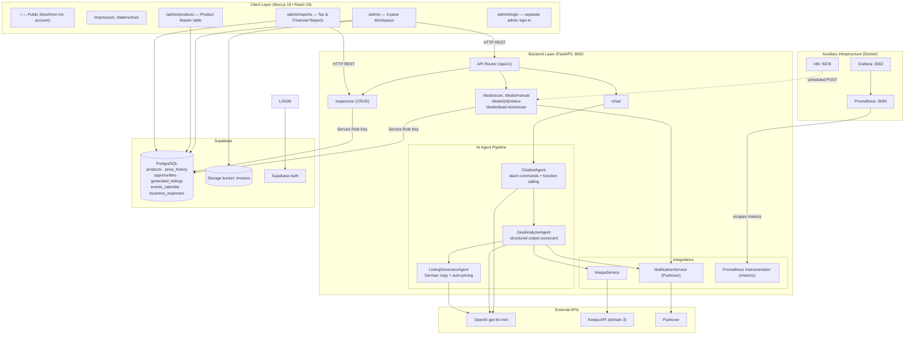
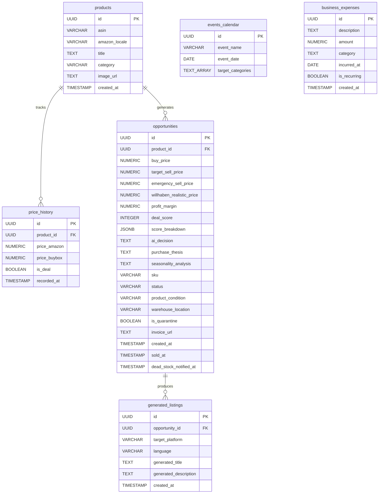
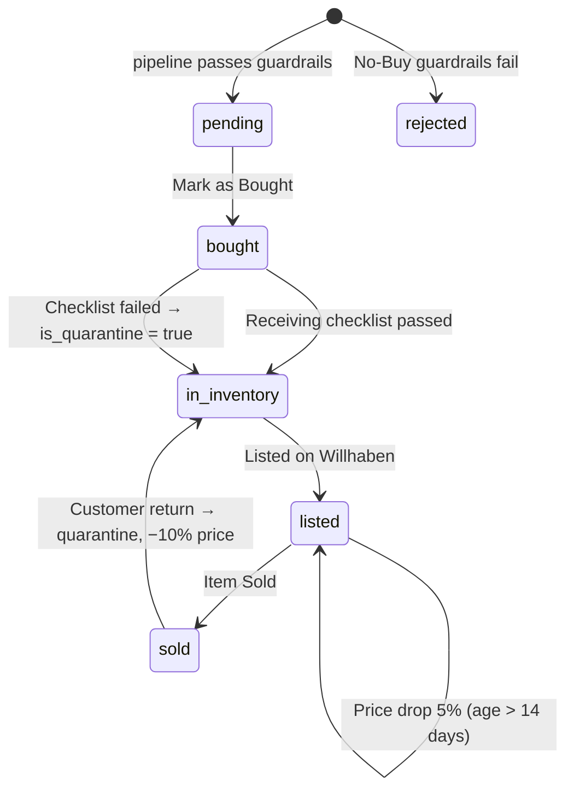

# 🚀 VINDERA — Technical Documentation

> **Cross-Border AI Arbitrage Engine** — A full-stack business intelligence platform that detects high-margin opportunities on Amazon (via Keepa API) using an AI agent pipeline, and generates localized, SEO-optimized listings for the Austrian second-hand marketplace Willhaben.

**Document Version:** 3.3
**Last Updated:** 2026-09-20
**Baseline Release:** `v2.7.0`
**Source:** Regenerated via full codebase inspection of `/Users/ridvanyigit/Desktop/vindera-workspace`.

---

## Table of Contents

1. [Overview](#1-overview)
2. [Architecture Diagram](#2-architecture-diagram)
3. [Technology Stack](#3-technology-stack)
4. [Project Directory Structure](#4-project-directory-structure)
5. [Environment Variables](#5-environment-variables)
6. [Backend (FastAPI)](#6-backend-fastapi)
7. [Database (Supabase / PostgreSQL)](#7-database-supabase--postgresql)
8. [Frontend (Next.js)](#8-frontend-nextjs)
9. [Design System & Typography](#9-design-system--typography)
10. [n8n Automation Layer](#10-n8n-automation-layer)
11. [Monitoring / Observability](#11-monitoring--observability)
12. [Local Development Setup](#12-local-development-setup)
13. [Known Issues & Technical Debt](#13-known-issues--technical-debt)
14. [Roadmap](#14-roadmap)

---

## 1. Overview

Vindera tracks price drops on Amazon.de using the **Keepa API**, evaluates arbitrage opportunities through an **OpenAI (gpt-4o-mini)** agent chain scored against a 10-criteria acquisition methodology, and generates Austrian-German, SEO-compliant listings for **Willhaben**.

| Layer | Technology | Responsibility |
|---|---|---|
| **Frontend** | Next.js 16 (App Router) | IDE-style resizable workspace, product master table, tax & financial reports with business-expense tracking, Austria market calendar |
| **Backend** | FastAPI (Python) | REST API, AI agent orchestration, deal scoring, guardrails |
| **Database** | Supabase (PostgreSQL) | Products, price history, opportunities, listings, event calendar, business expenses, invoice storage |
| **Automation** | n8n (Docker) | Scheduled daily ASIN batch scans and dead-stock check |
| **Monitoring** | Prometheus + Grafana (Docker) | Backend metric scraping and visualization |

### Core End-to-End Workflow



---

## 2. Architecture Diagram



---

## 3. Technology Stack

| Scope | Technology | Version |
|---|---|---|
| Frontend Framework | Next.js (App Router) | `16.3.4` |
| UI Runtime | React / React DOM | `19.2.8` |
| Styling | TailwindCSS (CSS-first `@theme`) | `^4` |
| UI Font | Inter (`next/font/google`) | variable |
| Mono Font | JetBrains Mono (`next/font/google`) | variable |
| Icons | lucide-react | `^1.45.0` |
| Charts | recharts | `^3.10.1` |
| Layout / Splitters | react-resizable-panels | `^4.12.4` |
| Date Utilities | date-fns | `^4.4.0` |
| DB Client (Frontend) | @supabase/supabase-js | `^2.116.0` |
| Backend Framework | FastAPI | `>=0.141.1` |
| ASGI Server | uvicorn[standard] | `>=0.52.4` |
| Python Runtime / Manager | CPython `>=3.14` / uv | `uv.lock` |
| Validation | Pydantic + pydantic-settings | `>=2.13.5` / `>=2.15.0` |
| HTTP Client (Backend) | httpx | `>=0.28.1` |
| AI SDK | openai (Python) | `>=3.13.0` |
| DB Client (Backend) | supabase (Python) | `>=2.31.0` |
| Metrics | prometheus-fastapi-instrumentator | `>=8.1.0` |
| Language Model | OpenAI `gpt-4o-mini` | — |
| Automation | n8n | `docker.n8n.io/n8nio/n8n` |
| Pricing Data | Keepa API (domain 3 = Amazon.de) | — |

---

## 4. Project Directory Structure

```
vindera-workspace/
├── .env                          # Git-ignored active secrets
├── .env.example                  # Environment template
├── CLAUDE.md                     # Guidance for Claude Code
├── README.md
├── TECH-DOKUMENTATION.md         # This document
│
├── backend/
│   ├── .python-version
│   ├── pyproject.toml
│   ├── uv.lock
│   └── src/
│       ├── main.py               # FastAPI app: CORS, lifespan, Prometheus, routers
│       ├── agents/
│       │   ├── chatbot_agent.py
│       │   ├── deal_analyzer_agent.py
│       │   └── listing_generator_agent.py
│       ├── api/endpoints/
│       │   ├── chat.py
│       │   ├── deals.py          # Scan pipeline, manual deals, status, dead-stock scan
│       │   └── expenses.py       # Business expense CRUD
│       ├── core/
│       │   ├── categories.py     # Canonical categories + Keepa category mapping
│       │   ├── config.py
│       │   └── database.py
│       └── services/
│           ├── keepa_service.py
│           └── notification_service.py
│
├── frontend/
│   ├── src/app/
│   │   ├── layout.tsx            # Root layout: Inter + JetBrains Mono font variables
│   │   ├── globals.css           # Design tokens, typography scale, scoped dark mode
│   │   ├── page.tsx              # Public storefront
│   │   ├── product/[id]/page.tsx # Public product detail
│   │   ├── impressum/page.tsx · datenschutz/page.tsx
│   │   └── admin/
│   │       ├── page.tsx          # 3-pane Workspace (protected)
│   │       ├── login/page.tsx    # Separate admin sign-in
│   │       ├── manual-entry/page.tsx  # Manual deal entry / edit form
│   │       ├── products/page.tsx      # Product Master (resizable table + CSV export)
│   │       └── reports/page.tsx       # Tax & Financial Reports + business expenses
│   ├── src/components/
│   │   ├── CommandBar.tsx        # Embedded AI terminal
│   │   ├── AustriaCalendarModal.tsx  # Austria market calendar (opened from AI Smart Radar)
│   │   └── ProductCard · CategoryQuadTile · HorizontalRail · StoreNav · StoreFooter
│   ├── src/lib/
│   │   ├── api.ts                # Backend base URL helper (NEXT_PUBLIC_API_URL)
│   │   ├── auth.ts               # Admin check (is_admin RPC)
│   │   ├── austriaCalendar.ts    # Austria calendar data + holiday computation
│   │   ├── constants.ts          # Categories, statuses, conditions, score criteria, expense categories
│   │   ├── recentlyViewed.ts · types.ts
│   │   ├── supabase.ts
│   │   └── useDarkMode.ts        # Dark/light mode hook (localStorage + system preference)
│   └── next.config.ts · tsconfig.json · eslint.config.mjs · postcss.config.mjs
│
├── supabase/
│   ├── config.toml
│   ├── seed.sql                  # Local-only seed data (runs on `supabase db reset`)
│   ├── .temp/                    # CLI cache (git-ignored)
│   └── migrations/               # Schema of record — never edit an applied migration
│
├── infrastructure/monitoring/
│   ├── docker-compose.yml        # Prometheus + Grafana
│   └── prometheus.yml
│
└── n8n/
    ├── docker-compose.yml
    └── Vindera_Daily_Scan.json   # Daily 08:15 batch scan + dead-stock check workflow
```

---

## 5. Environment Variables

Root template: `.env.example`. The backend resolves it via `env_file="../.env"` in `core/config.py`.

| Variable | Description | Required |
|---|---|---|
| `SUPABASE_URL` | Supabase project API URL | ✅ |
| `SUPABASE_ANON_KEY` | Public key (frontend) | Frontend |
| `SUPABASE_SERVICE_ROLE_KEY` | Admin key bypassing RLS | ✅ Backend |
| `OPENAI_API_KEY` | `gpt-4o-mini` access | Optional — falls back to mock data |
| `KEEPA_API_KEY` | Keepa access token | Optional — falls back to mock (€45 / €99) |
| `PUSHOVER_USER_KEY` | Pushover delivery token | Optional |
| `PUSHOVER_API_TOKEN` | Pushover app token | Optional |
| `ENVIRONMENT` | `development` / `production` | Default `development` |
| `FASTAPI_SECRET_KEY` | Application secret | Insecure default ⚠️ |
| `CORS_ALLOWED_ORIGINS` | Comma-separated origins allowed to call the API | Default: local dev servers |
| `GRAFANA_ADMIN_PASSWORD` | Grafana admin password (monitoring compose) | Default `admin` ⚠️ |

Frontend additionally uses `frontend/.env.local` with `NEXT_PUBLIC_SUPABASE_URL`, `NEXT_PUBLIC_SUPABASE_ANON_KEY` and `NEXT_PUBLIC_API_URL`.

---

## 6. Backend (FastAPI)

### 6.1 Application Entry — `backend/src/main.py`

- Real entrypoint:
  ```bash
  cd backend && uv run uvicorn src.main:app --host 0.0.0.0 --port 8000 --reload
  ```
- `lifespan` performs a Supabase connectivity probe against `products` on startup.
- **CORS:** origins come from `CORS_ALLOWED_ORIGINS` (comma-separated). A wildcard is deliberately not used because credentials are enabled.
- Prometheus metrics exposed at `/metrics`.
- Routers `deals`, `chat` and `expenses` mounted under `/api/v1`.

### 6.2 API Endpoints

| Method | Path | Description |
|---|---|---|
| `GET` | `/` | Health check |
| `GET` | `/metrics` | Prometheus scrape endpoint |
| `POST` | `/api/v1/chat/` | Dispatches a message to `ChatbotAgent` |
| `POST` | `/api/v1/deals/scan` | Queues a background deal scan for one ASIN. Returns `202 Accepted` immediately. Used by the n8n daily batch |
| `POST` | `/api/v1/deals/manual` | Persists a hand-entered deal (`products` → `opportunities` → `generated_listings`) through the service role. Returns `201` with the generated SKU and computed margin |
| `PUT` | `/api/v1/deals/{opportunity_id}/manual` | Replaces every editable field of an existing deal across all three tables. Stamps or clears `sold_at` as the status changes |
| `DELETE` | `/api/v1/deals/{opportunity_id}` | Deletes one opportunity and its generated listing. The `products` row and its price history are kept |
| `POST` | `/api/v1/deals/dead-stock/scan` | Queues the dead-stock check (see §6.6). Returns `202 Accepted`; called daily by n8n. Safe to call repeatedly — an item is only announced once |
| `POST` / `GET` | `/api/v1/expenses/` | Record one business expense / list all, newest first |
| `PUT` / `DELETE` | `/api/v1/expenses/{expense_id}` | Replace every editable field of an expense / delete it. `404` for an unknown id |
| `PATCH` | `/api/v1/deals/{opportunity_id}/status` | Updates lifecycle status and optional fields (`product_condition`, `is_quarantine`, `target_sell_price`, `purchase_thesis`); stamps `sold_at` when status becomes `sold`; returns `404` for an unknown id |

> The scan pipeline is also reachable from the workspace terminal via `/scan <ASIN>`.

### 6.3 Deal Scan Pipeline — `run_deal_scan_pipeline(asin)`

1. Fetch Keepa product data (or mock values if no key), including the product category.
2. Pick a simulated BuyBox seller via `random.choice` (Amazon / MediaMarkt AT / third-party FBM).
3. Load `events_calendar` rows for the next 90 days and pass them to the AI as seasonality context.
4. `DealAnalyzerAgent.analyze_deal(...)` produces the scorecard. A non-profitable verdict ends the run.
5. If profitable, `ListingGeneratorAgent` generates the German listing and suggested price.
6. **No-Buy Guardrails:** status is set to `rejected` when `estimated_profit_margin < 25` **or** raw profit `< €15`.
7. Persist `products` (upsert on `asin,amazon_locale`), 6 synthetic `price_history` rows, the `opportunity` (with generated SKU `GEN-XXXXXX`, emergency price = 85% of target, warehouse `A01`), and the `generated_listing`.
8. Push a Pushover alert only when `deal_score >= 80` **and** the deal was not rejected.

### 6.4 AI Agents

#### `ChatbotAgent` (`chatbot_agent.py`)
Two execution modes:

1. **Deterministic slash commands (no API credits needed):**
   - `/list` — inventory listing from `opportunities` joined with `products`
   - `/scan <ASIN>` — spawns `run_deal_scan_pipeline` via `asyncio.create_task`
   - `/delete <ASIN>` — cascade-deletes the product
   - `/help` — command reference
2. **Natural language mode (`gpt-4o-mini`)** with three declared tools: `get_inventory_status`, `scan_new_asin`, `delete_asin`. Every OpenAI call is wrapped: on auth or quota failure the agent returns a formatted banner pointing back to the slash commands. Unrecognized slash commands return the help text instead of falling through to the model.

#### `DealAnalyzerAgent` (`deal_analyzer_agent.py`)
Structured output via `client.beta.chat.completions.parse` against:

```python
class ScoreBreakdown(BaseModel):
    discount: int; demand: int; competition: int
    capital_efficiency: int; storage_size: int
    risk_level: int; seasonality: int          # each 0-10

class DealAnalysisResult(BaseModel):
    is_profitable: bool
    estimated_profit_margin: float
    reasoning: str
    deal_score: int                            # 0-100
    seasonality_analysis: str
    holding_period_months: int
    breakdown: ScoreBreakdown
    willhaben_realistic_price: float
    purchase_thesis: str
```

Risk weighting: Amazon-owned or FBA BuyBox scores high on `risk_level`; third-party FBM is penalized heavily.

#### `ListingGeneratorAgent` (`listing_generator_agent.py`)
Produces a `GeneratedListing` (title, structured German description, suggested price). The description template is intentionally **German** because it is published verbatim on Willhaben (`Zustand`, `Lieferumfang`, `Garantie/Rechnung`, `Übergabe`, `Bezahlung`).

Auto-pricing: `suggested_price = bought_price + (historical_price − bought_price) / 2`

### 6.5 Services

- **`KeepaService`** — `GET https://api.keepa.com/product` with `domain=3`, `stats=1`, `days=90`. Parses Keepa's cent-integer arrays; falls back from the Amazon price index to the third-party New index when Amazon is out of stock (`-1`). Maps Keepa's `categoryTree` onto the canonical categories in `core/categories.py`.
- **`NotificationService`** — Pushover POST at priority 1 with product title, buy price, margin and Amazon URL (hot deals). `send_dead_stock_alert()` sends one priority-0 digest for dead-stock items and returns `True` only when Pushover accepted it.

### 6.6 Dead-Stock Push Notification — `run_dead_stock_scan()`

Mirrors the "Dead Stock Alert" banner in the workspace inspector (open item older than 60 days), but proactively:

1. Select `opportunities` with status `bought` / `in_inventory` / `listed`, `created_at` older than `DEAD_STOCK_DAYS` (60) and `dead_stock_notified_at IS NULL`.
2. Keep only items strictly more than 60 full days old (same rule as the UI banner), sorted oldest first.
3. Send **one** Pushover digest (`Vindera Dead Stock`; messages are truncated below Pushover's 1024-character limit with a "+N more" line).
4. Only after Pushover accepts the message, stamp `dead_stock_notified_at`. An item is therefore announced once, and retried on the next run if delivery failed (missing credentials, network error).

Triggered by the second branch of the n8n workflow (§10) via `POST /api/v1/deals/dead-stock/scan`.

---

## 7. Database (Supabase / PostgreSQL)

Schema of record: `supabase/migrations/`.

### 7.0 Row Level Security

Migration `20260916140000_enable_rls_policies.sql` enables RLS on **the original five tables** and grants `SELECT` to the `authenticated` role only (`opportunities` additionally allows `UPDATE` for the in-browser invoice attachment). The blanket `anon` grants from the original remote schema are revoked.

Consequences:
- Every frontend route must have a valid Supabase session; all of them now guard for it.
- The backend is unaffected — the service role key bypasses RLS by design.
- Before this migration the public anon key could read the entire database without logging in, and `events_calendar` was unreadable because RLS was on with no policy at all.
- `business_expenses` (added later) follows the admin model: RLS on, `SELECT` for `is_admin()` only, no write policies — writes go through the backend's service role.

### 7.1 Tables

| Table | Purpose |
|---|---|
| `products` | Amazon catalogue entries, unique on `(asin, amazon_locale)` |
| `price_history` | Time-series of Amazon / BuyBox prices |
| `opportunities` | The core arbitrage record and its full lifecycle |
| `generated_listings` | AI-generated Willhaben copy per opportunity |
| `events_calendar` | Seasonal events used as AI seasonality context |
| `business_expenses` | Costs not tied to a single deal (storage, packaging, subscriptions, …); subtracted from gross profit on Tax & Reports. One row per payment; `is_recurring` only labels the row, it does not generate future rows |

**`opportunities` columns** (beyond the original set): `deal_score`, `holding_period_months`, `seasonality_analysis`, `sku`, `emergency_sell_price`, `warehouse_location`, `product_condition`, `days_in_inventory`, `is_quarantine`, `score_breakdown` (jsonb), `willhaben_realistic_price`, `purchase_thesis`, `invoice_url`, `sold_at`, `dead_stock_notified_at` (timestamp; set by the backend once the dead-stock push for the item was delivered; not exposed by `storefront_listings`).

All foreign keys cascade on delete. Invoice PDFs/images live in the Supabase Storage bucket **`invoices`**.

### 7.2 Entity Relationship Diagram



### 7.3 Opportunity Lifecycle



---

## 8. Frontend (Next.js)

### 8.1 Routes

Since `v1.20.0`, the app is split into a public storefront and an admin-only area gated on `admin_users` / `is_admin()` (not just "being logged in") — see §5.x on RLS. Since `v2.3.0` the storefront has **no customer account system**: nothing is purchasable on Vindera itself (every item redirects to its live Willhaben listing), so an account had nothing to do — the `wishlists` table, `/login` and `/wishlist` were removed. `/admin/login` is the sole, separate sign-in, used only by the admin.

| Route | Description |
|---|---|
| `/` | Public storefront — product rails of `in_inventory`/`listed` items from the `storefront_listings` view, "Buy on Willhaben" deep link. No account, no cart, no payment flow. A "How it works" note at the top explains that Vindera does not process purchases itself. |
| `/product/[id]` | Public product detail page |
| `/impressum` / `/datenschutz` | Legal notice and privacy policy |
| `/admin` | Three-pane resizable workspace (admin-only). Carries a dark/light mode toggle in the top-right nav. |
| `/admin/products` | Product Master: searchable table with pointer-driven column resizing and CSV export (admin-only). Dark/light toggle in the nav |
| `/admin/manual-entry` | Manual deal entry form — create a full opportunity without Keepa or OpenAI (admin-only). Dark/light toggle in the nav |
| `/admin/reports` | Tax & Financial Reports: KPI cards incl. **Net Profit** (gross profit − business expenses), VAT threshold bar, monthly bar chart (net profit per month), category pie chart, and the Business Expenses section (admin-only). Dark/light toggle in the nav |
| `/admin/login` | Separate, unlinked admin sign-in. Carries a fixed top-right dark/light mode toggle that persists across page load. |

### 8.2 Workspace (`src/app/admin/page.tsx`)

- **Left panel** — Tabs (`DEALS`, `INVENTORY`, `SOLD`, `REJECTED`), category filter, deal list with inventory-age badges; lower sub-panel holds the Financial & Risk dashboard (revenue vs. €55,000 threshold, gross profit, average ROI, average days-to-sell, inventory value, stress-test liquidation net) and the Quarterly Category Audit modal. Its header row holds the Quarterly Category Audit button.
- **Center panel** — Deal inspector: SKU / ASIN / warehouse location / condition strip, invoice upload to Supabase Storage, BuyBox trust badges, high-capital-exposure warning, AI scorecard with a 7-metric breakdown, Decision Journal, dead-stock alert after 60 days, and the action pipeline. Lower sub-panel embeds the AI terminal.
- **Right panel** — 3-tier price strategy cards (max buy / target sell / emergency), the Amazon price history chart (real `price_history` rows when two or more exist, otherwise a deterministic sample curve marked with a `Sample` badge), generated Willhaben listing with copy-to-clipboard. Lower sub-panel is the AI Smart Radar ranked by `deal_score` with the next calendar event countdown. The next-event badge (e.g. "Next: Halloween (T-40)") uses Tailwind's `animate-pulse` and an amber color scheme to draw attention — it is the most time-sensitive data point on the radar. A calendar icon at the far right of the radar header opens the Austria market calendar (§8.5).
- **Dark/light toggle:** Moon/Sun icon button in the top-right nav bar. Preference is persisted in `localStorage` under `'vindera-theme'`, with `prefers-color-scheme` as the fallback on first visit.
- **Realtime:** a Supabase channel on `opportunities` re-fetches on any change.
- **Layout reset:** double-clicking any splitter remounts the panel group at its default sizes.
- **Aligned bottom panels:** the lower panels of all three columns (Financial & Risk Dashboard, Vindera AI Terminal, AI Smart Radar) use identical vertical sizing — top `defaultSize={80}`, bottom `defaultSize={35}` / `minSize={35}` — so their top borders line up on initial load. In `react-resizable-panels` v4 numeric sizes are pixels; the group normalizes them proportionally, so the columns only line up when every column uses the same pair of numbers.
- **Click-to-minimize:** clicking the title of a bottom panel ("Financial & Risk Dashboard", "Vindera AI Terminal", "AI Smart Radar") shrinks that panel to its minimum height via the imperative panel API (`usePanelRef().resize(BOTTOM_PANEL_MIN_PX)`, 35 px). The panel never closes entirely — its header row stays visible — and it is restored by dragging the splitter or double-clicking it. The terminal title is wired through the `onTitleClick` prop of `CommandBar`. Keep `BOTTOM_PANEL_MIN_PX` in sync with the panels' `minSize`.

### 8.3 Embedded Terminal (`src/components/CommandBar.tsx`)

Typing `/` opens a React-Portal command palette anchored above the input (avoids overflow clipping). Messages are POSTed to the backend chat endpoint resolved by `src/lib/api.ts`.

Because the palette is rendered via `createPortal` to `document.body` — outside the `.vindera-admin` CSS scope — dark mode is applied with direct `dark:` Tailwind variants on the portal's root element and its children rather than via the scoped CSS overrides in `globals.css`.

### 8.4 Manual Entry (`src/app/admin/manual-entry/page.tsx`)

A full-width form for entering a deal by hand when Keepa or OpenAI credits are unavailable, or when back-filling stock that is already in the storage room. It covers every column the rest of the app reads, grouped into six sections: product identity, pricing strategy, acquisition scorecard (overall score plus the seven 0-10 criteria as sliders), lifecycle and logistics, decision notes, and the German Willhaben listing.

- **Guidance:** every field label carries a hover hint explaining where to find the value (ASIN in the Amazon URL, realistic price from comparable Willhaben listings, and so on).
- **Live preview:** gross profit and margin update as you type, with a badge mirroring the backend's No-Buy Guardrails (>= 25% margin AND >= €15 profit). It is informational — manual entries are never blocked.
- **Defaults:** SKU is auto-generated (regenerable), emergency price falls back to 85% of the target, realistic Willhaben price falls back to the target, and `profit_margin` is always recomputed server-side from the two prices.
- **Persistence:** `POST /api/v1/deals/manual`. The browser cannot write directly — RLS grants it `SELECT` only.
- **Edit mode:** `/admin/manual-entry?id=<opportunity_id>` loads an existing deal into the same form. Reached from the **Edit** button in the workspace deal inspector, or by clicking any row in the Product Master. Saving issues `PUT .../manual`; a **Delete** button issues `DELETE`. The two Amazon reference prices stay blank on load so the stored price history is preserved unless you deliberately re-enter them.
- **Price history:** filling in *Amazon Price Today* and *Amazon 90-Day Average* writes two real `price_history` rows (today, and 90 days back), which the workspace chart prefers over its sample curve.
- **Shared vocabulary:** categories, statuses, conditions and score criteria come from `src/lib/constants.ts`, which the workspace filter also uses.

### 8.5 Austria Market Calendar (`src/components/AustriaCalendarModal.tsx`, `src/lib/austriaCalendar.ts`)

Opened from the calendar icon in the AI Smart Radar header. A month grid (Monday first) with category filter chips, a detail panel for the selected day and a "Key dates ahead" list. Escape or a backdrop click closes it.

- **Prominent closures:** the 13 statutory Austrian public holidays and Sundays are marked red and flagged "Shops closed". Bridge days (*Fenstertage*), regional state holidays and Good Friday (not a public holiday in Austria) are shown separately.
- **Computed for any year** (`getCalendarItems(years)`): movable holidays from the Gregorian Easter algorithm, bridge days, Black Friday (Friday after the 4th Thursday of November), Black Week, Cyber Monday, Mother's/Father's Day, Valentine's Day, Halloween, first Advent and approximate Urlaubsgeld / Weihnachtsgeld payout dates (marked "ca.", they vary by collective agreement).
- **Curated data** (`STATIC_ITEMS`, researched Sep 2026, covering Sep 2026 – Sep 2027): school terms and holidays per federal state (bmb.gv.at), Amazon Prime Deal Days, ÖFB / Wiener Derby football, ski races (Sölden, Kitzbühel, Schladming), Vienna City Marathon, Formula 1 Austria (Spielberg), festivals (Nova Rock, Donauinselfest, Frequency), Christkindlmärkte and selected concerts. Each item carries an *impact* rating (high / medium / low) — a heuristic estimate of the effect on resale demand, not a measured value.
- **Independent of the database:** the calendar is static frontend data and deliberately **not** merged into `events_calendar`, so the radar's "Next:" badge and the AI seasonality prompt are not flooded with holidays. **Refresh `STATIC_ITEMS` once a year.**
- **Known gaps:** no confirmed 2027 stadium concerts were found; Post Christmas shipping cut-off dates are omitted (no reliable 2026 source); the Wiener Derby date may still shift.

### 8.6 Tax & Reports — Business Expenses (`src/app/admin/reports/page.tsx`)

Costs that do not belong to a single deal (storage rent, packaging, Keepa / OpenAI subscriptions, …) are recorded in `business_expenses`.

- **Net profit:** the KPI card shows `gross profit − total expenses`; the monthly chart plots net profit per month (months with expenses but no sales still appear). If expenses cannot be loaded the card says so instead of silently excluding them.
- **Read/write split:** the page reads `business_expenses` directly (admin-only RLS); adding and deleting expenses goes through `/api/v1/expenses/` (service role), following the write-path rule.
- **Form:** description, amount (> 0), category (`EXPENSE_CATEGORIES` in `constants.ts`; frontend-only vocabulary, the backend stores any non-empty category), date and a *Recurring* label.

---

## 9. Design System & Typography

Typography is centralized in `src/app/globals.css` and loaded in `src/app/layout.tsx`. No page defines its own font family.

- **UI typeface:** Inter, loaded via `next/font/google` as `--font-inter` and exposed to Tailwind as `--font-sans`.
- **Mono typeface:** JetBrains Mono as `--font-jetbrains-mono` → `--font-mono`, used for SKU, ASIN and slash commands.
- **Rendering:** antialiasing, `optimizeLegibility`, and Inter alternate glyph features (`cv02`–`cv11`).
- **Tabular figures:** all tables and any element with `tabular-nums` use fixed-width digits so prices and scores do not jitter between renders.

### Type scale (CSS custom properties)

| Token | Size | Tracking | Usage |
|---|---|---|---|
| `--text-display` | 28px | −0.025em | Login headline |
| `--text-title` | 22px | −0.02em | Page titles, KPI figures |
| `--text-heading` | 17px | −0.015em | Large inline values |
| `--text-subheading` | 15px | −0.015em | Card / section headings |
| `--text-body` | 14px | −0.006em | Default body |
| `--text-small` | 13px | −0.006em | Secondary copy, table cells |
| `--text-caption` | 12px | — | Captions |
| `--text-label` | 11px | +0.06em | Uppercase eyebrow labels |

### Semantic component classes

| Class | Applied to |
|---|---|
| `.type-page-title` | One per route: deal title, "Products", "Tax & Financial Reports" |
| `.type-section-title` | Card and modal headings |
| `.type-label` | Panel headers, table headers, uppercase eyebrows |
| `.type-metric` | KPI numbers (tabular figures) |
| `.type-body` | Paragraph copy in detail panels |

Weights are capped at `600` (semibold); `font-extrabold` is no longer used anywhere in the codebase.

### Dark Mode

Dark mode uses a **class-based** strategy: toggling `.dark` on `<html>` (Tailwind v4's `@custom-variant dark (&:where(.dark, .dark *))` in `globals.css`).

**Scope isolation:** All CSS overrides are nested under `.dark .vindera-admin { ... }` so the public storefront is completely unaffected. Every admin page (`/admin`, `/admin/products`, `/admin/manual-entry`, `/admin/reports`) puts `vindera-admin` on its root element and mounts the toggle via `useDarkMode()`; `globals.css` has extra rules for the page root itself (its own background/text, `color-scheme: dark` for native controls) and for the additional colour families those pages use.

**Color palette (GitHub Dark inspired):**

| Light class | Dark value |
|---|---|
| `bg-white` | `#161b22` |
| `bg-gray-50` | `#0d1117` |
| `bg-gray-100` | `#21262d` |
| `text-gray-900` | `#e6edf3` |
| `text-gray-500` | `#6e7681` |
| `border-gray-200` | `#30363d` |
| `bg-indigo-50` | `#1e1b4b` |
| `text-indigo-600` | `#818cf8` |

**`/admin/login` approach:** Uses direct `dark:` Tailwind variants (light-default + `dark:` override) rather than the scoped `.vindera-admin` CSS block, because the login page is standalone.

**Hook — `src/lib/useDarkMode.ts`:**
```ts
// useState lazy initializer reads localStorage key 'vindera-theme',
// falling back to window.matchMedia('(prefers-color-scheme: dark)').
// useEffect syncs the .dark class on document.documentElement.
// toggle() is a setDark functional update that also writes localStorage.
```
The lazy initializer pattern avoids the `react-hooks/set-state-in-effect` ESLint error that would occur if the initial read were done inside a `useEffect`.

---

## 10. n8n Automation Layer

`n8n/docker-compose.yml` runs n8n at `http://localhost:5678` with `GENERIC_TIMEZONE=Europe/Vienna` and a persistent `n8n_data` volume.

`n8n/Vindera_Daily_Scan.json` defines **Vindera Daily Auto-Scan**:

```
Schedule Trigger (cron 15 8 * * *)
  → Set ASIN List (comma-separated)
  → Split into Items (Code node)
  → HTTP POST http://host.docker.internal:8000/api/v1/deals/scan

Schedule Trigger (same run)
  → Trigger Dead Stock Check: HTTP POST http://host.docker.internal:8000/api/v1/deals/dead-stock/scan
```

The backend accepts both requests and returns `202 Accepted`; each ASIN is processed in a FastAPI background task, and the dead-stock check (§6.6) runs as its own background task. After changing the workflow JSON, re-import it in n8n.

---

## 11. Monitoring / Observability

- **Prometheus** (`:9090`) scrapes `host.docker.internal:8000/metrics` every 15 seconds (job `vindera_fastapi`). Data persists in the `prometheus_data` volume.
- **Grafana** (`:3002`) visualizes request rates, error frequency and latency. Dashboards persist in the `grafana_data` volume. The admin password comes from `GRAFANA_ADMIN_PASSWORD`.

---

## 12. Local Development Setup

```bash
# 1. Backend
cd backend && uv run uvicorn src.main:app --host 0.0.0.0 --port 8000 --reload

# 2. n8n
cd n8n && docker compose up -d

# 3. Monitoring
cd infrastructure/monitoring && docker compose up -d

# 4. Frontend
cd frontend && npm run dev
```

> ⚠️ Apply migrations with `supabase db push` before starting the frontend, otherwise RLS policies will be missing and every query returns empty.

### Port Map

| Service | Address | Credentials |
|---|---|---|
| Frontend | `http://localhost:3000` | Supabase Auth |
| Backend API | `http://localhost:8000` | None |
| Prometheus | `http://localhost:9090` | None |
| Grafana | `http://localhost:3002` | `admin` / `$GRAFANA_ADMIN_PASSWORD` |
| n8n | `http://localhost:5678` | Set on first run |

---

## 13. Known Issues & Technical Debt

**Resolved in `v1.18.0`** — kept here as a short changelog: the missing `/deals/scan` endpoint, the incomplete `DealAnalyzerAgent` mock fallback, the policy-less RLS on `events_calendar`, the CORS wildcard, the hardcoded Grafana password and port collision, the hardcoded localhost API URL, the hardcoded product category, the `/products` status-vocabulary mismatch and the random-data price chart.

**Open**

1. **Simulated BuyBox data** — `_pick_mock_buybox()` in `deals.py` picks randomly between three mock sellers. Replace with real Keepa merchant data once live credits are active; the function is isolated and marked with a `TODO`.
2. **Seeded price history** — `_build_price_history()` writes six rows of flat historical values per scan. The chart already prefers real rows, so this becomes a non-issue as soon as Keepa's daily CSV history is imported.
3. **Insecure secret fallback** — `FASTAPI_SECRET_KEY` still defaults to `"default_secret_if_not_set"`. It is currently unused by any code path, but should be set before anything starts signing tokens with it.
4. **`next-themes`** is listed in `package.json` but never imported. Remove with `npm uninstall next-themes` so `package-lock.json` stays consistent.
5. **No automated tests** (`pytest`, `jest`) and no CI/CD workflows.
6. **Category mapping is keyword-based** — `core/categories.py` maps Keepa's German category names heuristically. Unmatched products land in `Other`; extend `_KEYWORD_MAP` as new categories appear.
7. The German copy in `ListingGeneratorAgent` is intentional — it is the published Willhaben listing text, not UI chrome. Do not translate it.

---

## 14. Roadmap

- [ ] Wire live Keepa credentials for real BuyBox ownership and daily price history.
- [ ] Import Keepa's full CSV price history instead of seeding six synthetic rows.
- [ ] Migrate the agent chain to an agentic framework (LangGraph / CrewAI).
- [ ] Add pytest / jest suites and a GitHub Actions pipeline.
- [ ] Add the production frontend domain to `CORS_ALLOWED_ORIGINS` before deploying.
- [ ] Move local Docker services to AWS with Terraform provisioning.

---

## 15. Release Changelog

| Tag | Date | Summary |
|---|---|---|
| `v2.7.0` | 2026-09-20 | Click-to-minimize on the Financial & Risk Dashboard, Vindera AI Terminal and AI Smart Radar titles (panels shrink to their 35 px minimum, header stays visible); `CommandBar` gains `onTitleClick`; documentation update to v3.3 |
| `v2.6.0` | 2026-09-20 | Austria market calendar (calendar icon in the AI Smart Radar header): public holidays, bridge days, shopping days, school terms, sports, festivals, concerts |
| `v2.5.1` | 2026-09-20 | Align default panel heights of Financial & Risk Dashboard and AI Smart Radar with the AI Terminal (80 / 35 in every column) |
| `v2.5.0` | 2026-09-20 | Dead-stock Pushover notification (`/deals/dead-stock/scan`, `dead_stock_notified_at`, n8n trigger); business expense tracking and Net Profit on Tax & Reports (`business_expenses`, `/expenses/`); dark/light toggle on Product Master and Manual Entry; "How it works" note on the storefront homepage |
| `v2.4.1` | 2026-09-20 | Remove "WORKSPACE" subtitle from nav logo; add amber `animate-pulse` badge to AI Smart Radar next-event countdown |
| `v2.4.0` | 2026-09-20 | Dark/light mode toggle on `/admin` and `/admin/login`; `useDarkMode` hook; `globals.css` scoped overrides; `CommandBar` portal `dark:` variants |
| `v2.3.1` | 2026-09-20 | Rename "New Deals" tab to "Deals"; fix Financial & Risk panel vertical alignment (`defaultSize` 20 → 30) |
| `v2.3.0` | 2026-09-18 | Remove customer account system (wishlists, `/login`, `/wishlist`); no purchasable items on Vindera |
| `v2.2.0` | 2026-09-18 | Remove Google/Apple OAuth; fix footer pinning on short pages |
| `v2.1.0` | 2026-09-17 | Redesign homepage into scrollable product rails (new arrivals, open-box, recently-viewed) |
| `v2.0.0` | 2026-09-16 | Split into public storefront and admin back office |

---
*Documentation compiled and maintained for the Vindera workspace repository.*
