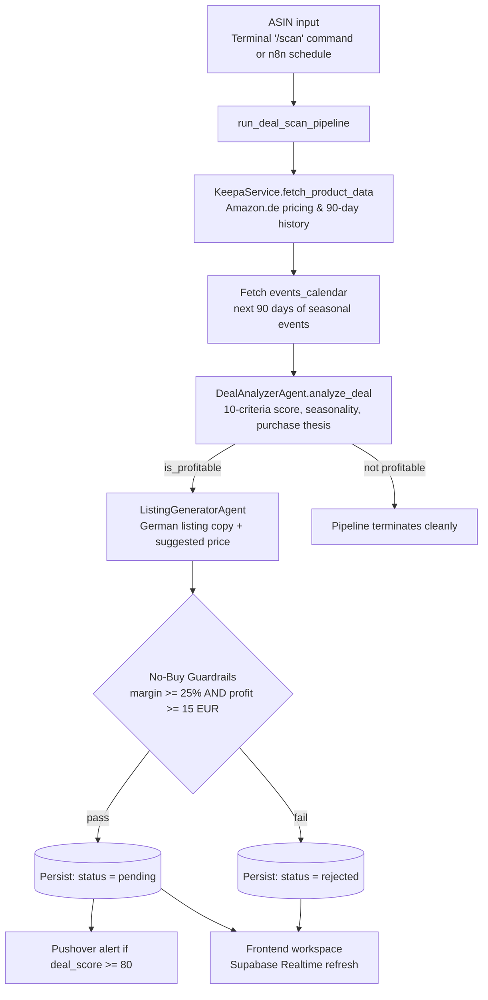
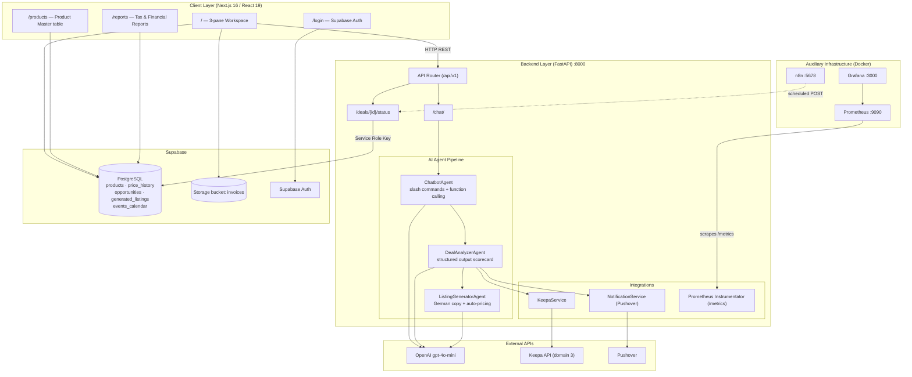
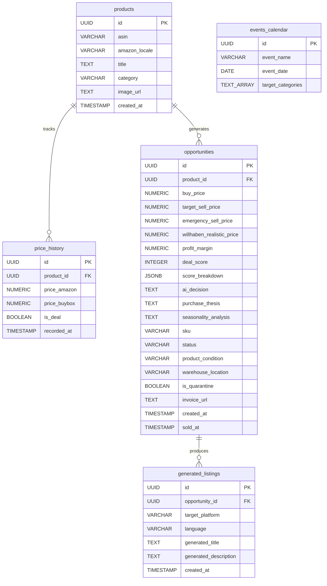
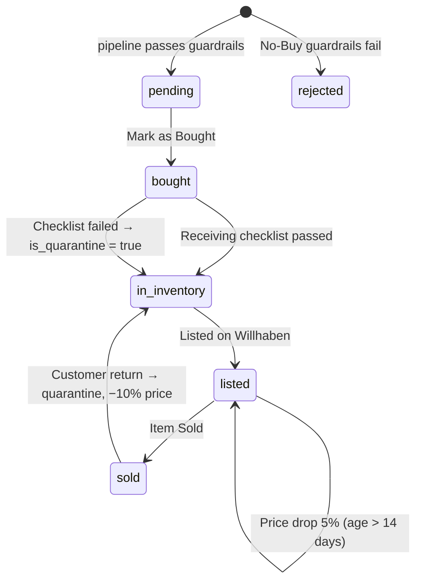

# 🚀 VINDERA — Technical Documentation

> **Cross-Border AI Arbitrage Engine** — A full-stack business intelligence platform that detects high-margin opportunities on Amazon (via Keepa API) using an AI agent pipeline, and generates localized, SEO-optimized listings for the Austrian second-hand marketplace Willhaben.

**Document Version:** 2.0
**Last Updated:** 2026-09-16
**Baseline Release:** `v1.16.0`
**Source:** Regenerated via full codebase inspection of `/Users/ridvanyigit/Desktop/vindera-workspace`.

---

## Table of Contents

1. [Overview](#1-overview)
2. [Architecture Diagram](#2-architecture-diagram)
3. [Technology Stack](#3-technology-stack)
4. [Project Directory Structure](#4-project-directory-structure)
5. [Environment Variables](#5-environment-variables)
6. [Backend (FastAPI)](#6-backend-fastapi)
7. [Database (Supabase / PostgreSQL)](#7-database-supabase--postgresql)
8. [Frontend (Next.js)](#8-frontend-nextjs)
9. [Design System & Typography](#9-design-system--typography)
10. [n8n Automation Layer](#10-n8n-automation-layer)
11. [Monitoring / Observability](#11-monitoring--observability)
12. [Local Development Setup](#12-local-development-setup)
13. [Known Issues & Technical Debt](#13-known-issues--technical-debt)
14. [Roadmap](#14-roadmap)

---

## 1. Overview

Vindera tracks price drops on Amazon.de using the **Keepa API**, evaluates arbitrage opportunities through an **OpenAI (gpt-4o-mini)** agent chain scored against a 10-criteria acquisition methodology, and generates Austrian-German, SEO-compliant listings for **Willhaben**.

| Layer | Technology | Responsibility |
|---|---|---|
| **Frontend** | Next.js 16 (App Router) | IDE-style resizable workspace, product master table, tax & financial reports |
| **Backend** | FastAPI (Python) | REST API, AI agent orchestration, deal scoring, guardrails |
| **Database** | Supabase (PostgreSQL) | Products, price history, opportunities, listings, event calendar, invoice storage |
| **Automation** | n8n (Docker) | Scheduled daily ASIN batch scans |
| **Monitoring** | Prometheus + Grafana (Docker) | Backend metric scraping and visualization |

### Core End-to-End Workflow



---

## 2. Architecture Diagram



---

## 3. Technology Stack

| Scope | Technology | Version |
|---|---|---|
| Frontend Framework | Next.js (App Router) | `16.3.4` |
| UI Runtime | React / React DOM | `19.2.8` |
| Styling | TailwindCSS (CSS-first `@theme`) | `^4` |
| UI Font | Inter (`next/font/google`) | variable |
| Mono Font | JetBrains Mono (`next/font/google`) | variable |
| Icons | lucide-react | `^1.45.0` |
| Charts | recharts | `^3.10.1` |
| Layout / Splitters | react-resizable-panels | `^4.12.4` |
| Date Utilities | date-fns | `^4.4.0` |
| DB Client (Frontend) | @supabase/supabase-js | `^2.116.0` |
| Backend Framework | FastAPI | `>=0.141.1` |
| ASGI Server | uvicorn[standard] | `>=0.52.4` |
| Python Runtime / Manager | CPython `>=3.14` / uv | `uv.lock` |
| Validation | Pydantic + pydantic-settings | `>=2.13.5` / `>=2.15.0` |
| HTTP Client (Backend) | httpx | `>=0.28.1` |
| AI SDK | openai (Python) | `>=3.13.0` |
| DB Client (Backend) | supabase (Python) | `>=2.31.0` |
| Metrics | prometheus-fastapi-instrumentator | `>=8.1.0` |
| Language Model | OpenAI `gpt-4o-mini` | — |
| Automation | n8n | `docker.n8n.io/n8nio/n8n` |
| Pricing Data | Keepa API (domain 3 = Amazon.de) | — |

---

## 4. Project Directory Structure

```
vindera-workspace/
├── .env                          # Git-ignored active secrets
├── .env.example                  # Environment template
├── README.md
├── TECH-DOKUMENTATION.md         # This document
│
├── backend/
│   ├── .python-version
│   ├── main.py                   # uv init artifact (UNUSED — real entry is src/main.py)
│   ├── pyproject.toml
│   ├── uv.lock
│   └── src/
│       ├── main.py               # FastAPI app: CORS, lifespan, Prometheus, routers
│       ├── agents/
│       │   ├── chatbot_agent.py
│       │   ├── deal_analyzer_agent.py
│       │   └── listing_generator_agent.py
│       ├── api/endpoints/
│       │   ├── chat.py
│       │   └── deals.py
│       ├── core/
│       │   ├── config.py
│       │   └── database.py
│       └── services/
│           ├── keepa_service.py
│           └── notification_service.py
│
├── frontend/
│   ├── src/app/
│   │   ├── layout.tsx            # Root layout: Inter + JetBrains Mono font variables
│   │   ├── globals.css           # Design tokens & typography scale
│   │   ├── page.tsx              # Workspace dashboard (protected)
│   │   ├── login/page.tsx        # Supabase Auth login
│   │   ├── products/page.tsx     # Product Master (resizable table + CSV export)
│   │   └── reports/page.tsx      # Tax & Financial Reports
│   ├── src/components/CommandBar.tsx
│   ├── src/lib/supabase.ts
│   ├── next.config.ts · tsconfig.json · eslint.config.mjs · postcss.config.mjs
│   └── tailwind.config.ts        # Legacy v3-style config, not loaded by Tailwind v4
│
├── supabase/
│   ├── config.toml
│   ├── .temp/                    # CLI cache (git-ignored)
│   └── migrations/
│       └── 20260916082200_remote_schema.sql
│
├── infrastructure/monitoring/
│   ├── docker-compose.yml        # Prometheus + Grafana
│   └── prometheus.yml
│
└── n8n/
    ├── docker-compose.yml
    └── Vindera_Daily_Scan.json   # Daily 08:15 batch scan workflow
```

---

## 5. Environment Variables

Root template: `.env.example`. The backend resolves it via `env_file="../.env"` in `core/config.py`.

| Variable | Description | Required |
|---|---|---|
| `SUPABASE_URL` | Supabase project API URL | ✅ |
| `SUPABASE_ANON_KEY` | Public key (frontend) | Frontend |
| `SUPABASE_SERVICE_ROLE_KEY` | Admin key bypassing RLS | ✅ Backend |
| `OPENAI_API_KEY` | `gpt-4o-mini` access | Optional — falls back to mock data |
| `KEEPA_API_KEY` | Keepa access token | Optional — falls back to mock (€45 / €99) |
| `PUSHOVER_USER_KEY` | Pushover delivery token | Optional |
| `PUSHOVER_API_TOKEN` | Pushover app token | Optional |
| `ENVIRONMENT` | `development` / `production` | Default `development` |
| `FASTAPI_SECRET_KEY` | Application secret | Insecure default ⚠️ |

Frontend additionally uses `frontend/.env.local` with `NEXT_PUBLIC_SUPABASE_URL` and `NEXT_PUBLIC_SUPABASE_ANON_KEY`.

---

## 6. Backend (FastAPI)

### 6.1 Application Entry — `backend/src/main.py`

- Real entrypoint (not `backend/main.py`):
  ```bash
  cd backend && uv run uvicorn src.main:app --host 0.0.0.0 --port 8000 --reload
  ```
- `lifespan` performs a Supabase connectivity probe against `products` on startup.
- CORS is fully open (`allow_origins=["*"]` with credentials) — see [§13](#13-known-issues--technical-debt).
- Prometheus metrics exposed at `/metrics`.
- Routers `deals` and `chat` mounted under `/api/v1`.

### 6.2 API Endpoints

| Method | Path | Description |
|---|---|---|
| `GET` | `/` | Health check |
| `GET` | `/metrics` | Prometheus scrape endpoint |
| `POST` | `/api/v1/chat/` | Dispatches a message to `ChatbotAgent` |
| `PATCH` | `/api/v1/deals/{opportunity_id}/status` | Updates lifecycle status and optional fields (`product_condition`, `is_quarantine`, `target_sell_price`, `purchase_thesis`); stamps `sold_at` when status becomes `sold` |

> ⚠️ **`POST /api/v1/deals/scan` does not currently exist.** The pipeline is only reachable through the chatbot (`/scan <ASIN>`). The n8n workflow still posts to this path and therefore fails. See [§13](#13-known-issues--technical-debt).

### 6.3 Deal Scan Pipeline — `run_deal_scan_pipeline(asin)`

1. Fetch Keepa product data (or mock values if no key).
2. Pick a simulated BuyBox seller via `random.choice` (Amazon / MediaMarkt AT / third-party FBM).
3. Load `events_calendar` rows for the next 90 days and pass them to the AI as seasonality context.
4. `DealAnalyzerAgent.analyze_deal(...)` produces the scorecard.
5. If profitable, `ListingGeneratorAgent` generates the German listing and suggested price.
6. **No-Buy Guardrails:** status is set to `rejected` when `estimated_profit_margin < 25` **or** raw profit `< €15`.
7. Persist `products` (upsert on `asin,amazon_locale`), 6 synthetic `price_history` rows, the `opportunity` (with generated SKU `GEN-XXXXXX`, emergency price = 85% of target, warehouse `A01`), and the `generated_listing`.
8. Push a Pushover alert only when `deal_score >= 80` **and** the deal was not rejected.

### 6.4 AI Agents

#### `ChatbotAgent` (`chatbot_agent.py`)
Two execution modes:

1. **Deterministic slash commands (no API credits needed):**
   - `/list` — inventory listing from `opportunities` joined with `products`
   - `/scan <ASIN>` — spawns `run_deal_scan_pipeline` via `asyncio.create_task`
   - `/delete <ASIN>` — cascade-deletes the product
   - `/help` — command reference
2. **Natural language mode (`gpt-4o-mini`)** with three declared tools: `get_inventory_status`, `scan_new_asin`, `delete_asin`. Falls back to a formatted error banner when OpenAI auth or quota fails.

#### `DealAnalyzerAgent` (`deal_analyzer_agent.py`)
Structured output via `client.beta.chat.completions.parse` against:

```python
class ScoreBreakdown(BaseModel):
    discount: int; demand: int; competition: int
    capital_efficiency: int; storage_size: int
    risk_level: int; seasonality: int          # each 0-10

class DealAnalysisResult(BaseModel):
    is_profitable: bool
    estimated_profit_margin: float
    reasoning: str
    deal_score: int                            # 0-100
    seasonality_analysis: str
    holding_period_months: int
    breakdown: ScoreBreakdown
    willhaben_realistic_price: float
    purchase_thesis: str
```

Risk weighting: Amazon-owned or FBA BuyBox scores high on `risk_level`; third-party FBM is penalized heavily.

#### `ListingGeneratorAgent` (`listing_generator_agent.py`)
Produces a `GeneratedListing` (title, structured German description, suggested price). The description template is intentionally **German** because it is published verbatim on Willhaben (`Zustand`, `Lieferumfang`, `Garantie/Rechnung`, `Übergabe`, `Bezahlung`).

Auto-pricing: `suggested_price = bought_price + (historical_price − bought_price) / 2`

### 6.5 Services

- **`KeepaService`** — `GET https://api.keepa.com/product` with `domain=3`, `stats=1`, `days=90`. Parses Keepa's cent-integer arrays; falls back from the Amazon price index to the third-party New index when Amazon is out of stock (`-1`).
- **`NotificationService`** — Pushover POST at priority 1 with product title, buy price, margin and Amazon URL.

---

## 7. Database (Supabase / PostgreSQL)

Schema of record: `supabase/migrations/20260916082200_remote_schema.sql`.

### 7.1 Tables

| Table | Purpose |
|---|---|
| `products` | Amazon catalogue entries, unique on `(asin, amazon_locale)` |
| `price_history` | Time-series of Amazon / BuyBox prices |
| `opportunities` | The core arbitrage record and its full lifecycle |
| `generated_listings` | AI-generated Willhaben copy per opportunity |
| `events_calendar` | Seasonal events used as AI seasonality context (RLS enabled) |

**`opportunities` columns** (beyond the original set): `deal_score`, `holding_period_months`, `seasonality_analysis`, `sku`, `emergency_sell_price`, `warehouse_location`, `product_condition`, `days_in_inventory`, `is_quarantine`, `score_breakdown` (jsonb), `willhaben_realistic_price`, `purchase_thesis`, `invoice_url`, `sold_at`.

All foreign keys cascade on delete. Invoice PDFs/images live in the Supabase Storage bucket **`invoices`**.

### 7.2 Entity Relationship Diagram



### 7.3 Opportunity Lifecycle



---

## 8. Frontend (Next.js)

### 8.1 Routes

| Route | Description |
|---|---|
| `/login` | Supabase email/password auth, password visibility toggle, hard redirect on success |
| `/` | Three-pane resizable workspace (protected) |
| `/products` | Product Master: searchable table with pointer-driven column resizing and CSV export |
| `/reports` | Tax & Financial Reports: KPI cards, VAT threshold bar, monthly bar chart, category pie chart |

### 8.2 Workspace (`src/app/page.tsx`)

- **Left panel** — Tabs (`NEW`, `INVENTORY`, `SOLD`, `REJECTED`), category filter, deal list with inventory-age badges; lower sub-panel holds the Financial & Risk dashboard (revenue vs. €55,000 threshold, gross profit, average ROI, average days-to-sell, inventory value, stress-test liquidation net) and the Quarterly Category Audit modal.
- **Center panel** — Deal inspector: SKU / ASIN / warehouse location / condition strip, invoice upload to Supabase Storage, BuyBox trust badges, high-capital-exposure warning, AI scorecard with a 7-metric breakdown, Decision Journal, dead-stock alert after 60 days, and the action pipeline. Lower sub-panel embeds the AI terminal.
- **Right panel** — 3-tier price strategy cards (max buy / target sell / emergency), 12-month trend chart (currently mock data), generated Willhaben listing with copy-to-clipboard. Lower sub-panel is the AI Smart Radar ranked by `deal_score` with the next calendar event countdown.
- **Realtime:** a Supabase channel on `opportunities` re-fetches on any change.
- **Layout reset:** double-clicking any splitter remounts the panel group at its default sizes.

### 8.3 Embedded Terminal (`src/components/CommandBar.tsx`)

Typing `/` opens a React-Portal command palette anchored above the input (avoids overflow clipping). Messages are POSTed to `http://localhost:8000/api/v1/chat/`.

---

## 9. Design System & Typography

Typography is centralized in `src/app/globals.css` and loaded in `src/app/layout.tsx`. No page defines its own font family.

- **UI typeface:** Inter, loaded via `next/font/google` as `--font-inter` and exposed to Tailwind as `--font-sans`.
- **Mono typeface:** JetBrains Mono as `--font-jetbrains-mono` → `--font-mono`, used for SKU, ASIN and slash commands.
- **Rendering:** antialiasing, `optimizeLegibility`, and Inter alternate glyph features (`cv02`–`cv11`).
- **Tabular figures:** all tables and any element with `tabular-nums` use fixed-width digits so prices and scores do not jitter between renders.

### Type scale (CSS custom properties)

| Token | Size | Tracking | Usage |
|---|---|---|---|
| `--text-display` | 28px | −0.025em | Login headline |
| `--text-title` | 22px | −0.02em | Page titles, KPI figures |
| `--text-heading` | 17px | −0.015em | Large inline values |
| `--text-subheading` | 15px | −0.015em | Card / section headings |
| `--text-body` | 14px | −0.006em | Default body |
| `--text-small` | 13px | −0.006em | Secondary copy, table cells |
| `--text-caption` | 12px | — | Captions |
| `--text-label` | 11px | +0.06em | Uppercase eyebrow labels |

### Semantic component classes

| Class | Applied to |
|---|---|
| `.type-page-title` | One per route: deal title, "Products", "Tax & Financial Reports" |
| `.type-section-title` | Card and modal headings |
| `.type-label` | Panel headers, table headers, uppercase eyebrows |
| `.type-metric` | KPI numbers (tabular figures) |
| `.type-body` | Paragraph copy in detail panels |

Weights are capped at `600` (semibold); `font-extrabold` is no longer used anywhere in the codebase.

---

## 10. n8n Automation Layer

`n8n/docker-compose.yml` runs n8n at `http://localhost:5678` with `GENERIC_TIMEZONE=Europe/Vienna` and a persistent `n8n_data` volume.

`n8n/Vindera_Daily_Scan.json` defines **Vindera Daily Auto-Scan**:

```
Schedule Trigger (cron 15 8 * * *)
  → Set ASIN List (comma-separated)
  → Split into Items (Code node)
  → HTTP POST http://host.docker.internal:8000/api/v1/deals/scan
```

> ⚠️ The final HTTP node targets an endpoint that is not implemented in the backend. The workflow will return 404 until the scan endpoint is added.

---

## 11. Monitoring / Observability

- **Prometheus** (`:9090`) scrapes `host.docker.internal:8000/metrics` every 15 seconds (job `vindera_fastapi`).
- **Grafana** (`:3000`) visualizes request rates, error frequency and latency.

---

## 12. Local Development Setup

```bash
# 1. Backend
cd backend && uv run uvicorn src.main:app --host 0.0.0.0 --port 8000 --reload

# 2. n8n
cd n8n && docker compose up -d

# 3. Monitoring
cd infrastructure/monitoring && docker compose up -d

# 4. Frontend
cd frontend && npm run dev
```

### Port Map

| Service | Address | Credentials |
|---|---|---|
| Frontend | `http://localhost:3000` (or `3001` on collision) | Supabase Auth |
| Backend API | `http://localhost:8000` | None |
| Prometheus | `http://localhost:9090` | None |
| Grafana | `http://localhost:3000` ⚠️ collides with Next.js | `admin / admin` |
| n8n | `http://localhost:5678` | Set on first run |

---

## 13. Known Issues & Technical Debt

**Blocking / functional**

1. **Missing scan endpoint.** `POST /api/v1/deals/scan` is referenced by the n8n workflow and by this document's original version, but no such route exists in `api/endpoints/deals.py`. `ScanRequest` and the `BackgroundTasks` import are present and unused, waiting for this endpoint.
2. **`DealAnalyzerAgent` mock fallback is incomplete.** The `except` branch constructs `DealAnalysisResult` without `willhaben_realistic_price` and `purchase_thesis`, both of which are required fields. Any OpenAI failure therefore raises a `ValidationError` instead of degrading gracefully.
3. **`events_calendar` has RLS enabled with no policies.** The frontend reads it with the anon key, so `upcomingEvents` will always be empty until a `SELECT` policy is added. The backend is unaffected (service role bypasses RLS).

**Security / configuration**

4. **CORS wildcard** with `allow_credentials=True` in `src/main.py`. Restrict to explicit origins in production.
5. **Hardcoded Grafana password** (`GF_SECURITY_ADMIN_PASSWORD=admin`). Move to `.env`.
6. **Insecure secret fallback** — `FASTAPI_SECRET_KEY` defaults to `"default_secret_if_not_set"`.
7. **Hardcoded `http://localhost:8000`** in `page.tsx` and `CommandBar.tsx`. Should be `process.env.NEXT_PUBLIC_API_URL`.
8. **Grafana / Next.js port collision** on `3000`. Remap Grafana to `3002:3000`.

**Data quality**

9. **Simulated BuyBox data** — `random.choice` over three mock sellers instead of real Keepa merchant data.
10. **Synthetic price history** — six rows of flat historical values are inserted per scan; the 12-month trend chart in the right panel is also generated with `Math.random()`.
11. **Category is hardcoded** to `"Technology & Electronics"` throughout the pipeline, so the category filter and the Category Audit only ever see one bucket.
12. **Status vocabulary mismatch** — `/products` `getStatusStyle` styles a status called `inventory`, but the backend writes `bought` / `in_inventory` / `listed`. Those rows fall through to the default grey badge.

**Project hygiene**

13. `frontend/tailwind.config.ts` is a Tailwind v3-style config. Tailwind v4 is CSS-first via `@theme` in `globals.css` and does not load it unless referenced with `@config`.
14. `next-themes` is listed in `package.json` but never imported.
15. `backend/main.py` is an unused `uv init` artifact.
16. No automated tests (`pytest`, `jest`) and no CI/CD workflows.
17. The German copy in `ListingGeneratorAgent` is intentional — it is the published Willhaben listing text, not UI chrome.

---

## 14. Roadmap

- [ ] Implement `POST /api/v1/deals/scan` and re-enable the n8n daily batch.
- [ ] Complete the `DealAnalyzerAgent` mock fallback so offline mode never raises.
- [ ] Add a `SELECT` RLS policy to `events_calendar`.
- [ ] Wire live Keepa credentials for real BuyBox and price history data.
- [ ] Derive the product category from Keepa instead of hardcoding it.
- [ ] Replace the mock 12-month trend with real `price_history` rows.
- [ ] Extract API base URL into `NEXT_PUBLIC_API_URL`.
- [ ] Add pytest / jest suites and a GitHub Actions pipeline.
- [ ] Move local Docker services to AWS with Terraform provisioning.

---
*Documentation compiled and maintained for the Vindera workspace repository.*
