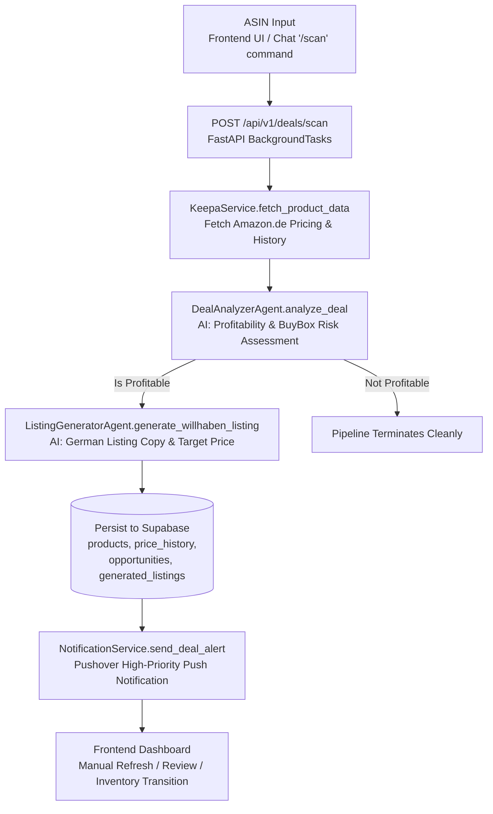
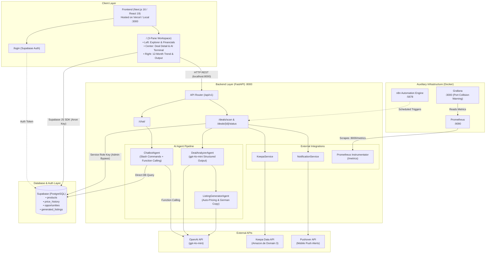
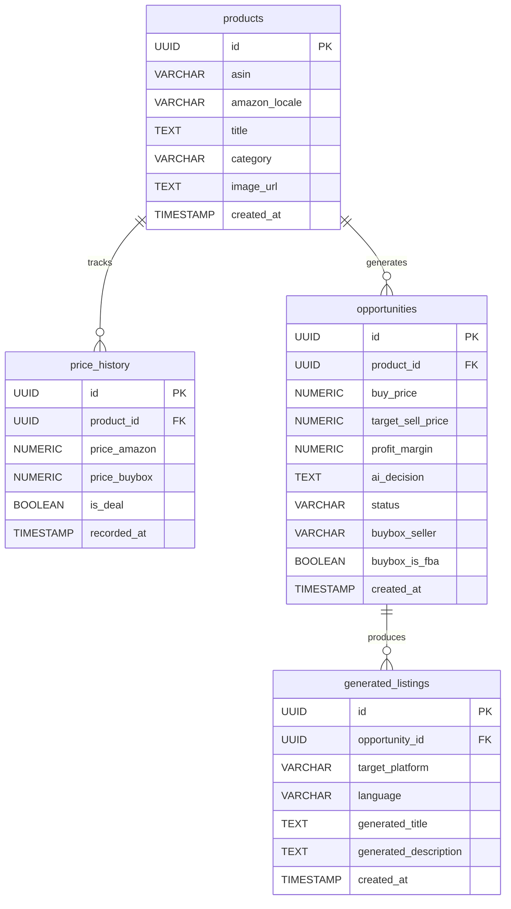
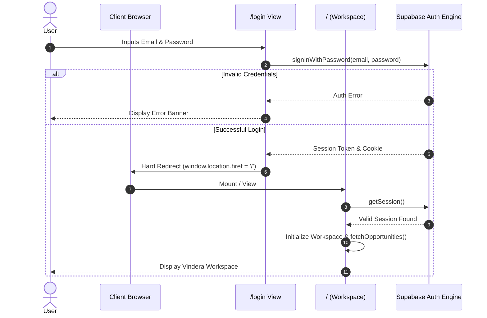

# 🚀 VINDERA — Technical Documentation

> **Cross-Border AI Arbitrage Engine** — A full-stack business intelligence platform that detects high-margin opportunities on Amazon (via Keepa API) using an AI agent pipeline, and automatically generates localized, SEO-optimized listings for European second-hand marketplaces (Willhaben / Austria).

**Document Version:** 1.0  
**Generated Date:** 2026-09-14  
**Source:** Automatically generated via codebase inspection of `/Users/ridvanyigit/Desktop/vindera-workspace`.

---

## Table of Contents

1. [Overview](#1-overview)
2. [Architecture Diagram](#2-architecture-diagram)
3. [Technology Stack](#3-technology-stack)
4. [Project Directory Structure](#4-project-directory-structure)
5. [Environment Variables (.env)](#5-environment-variables-env)
6. [Backend (FastAPI)](#6-backend-fastapi)
7. [Database (Supabase / PostgreSQL)](#7-database-supabase--postgresql)
8. [Frontend (Next.js)](#8-frontend-nextjs)
9. [n8n Automation Layer](#9-n8n-automation-layer)
10. [Monitoring / Observability](#10-monitoring--observability)
11. [Local Development Setup](#11-local-development-setup)
12. [Security & Technical Debt Notes](#12-security--technical-debt-notes)
13. [Roadmap](#13-roadmap)
14. [Appendix: Complete File Inventory](#14-appendix-complete-file-inventory)

---

## 1. Overview

Vindera tracks price drops on Amazon.de using the **Keepa API**, evaluates these arbitrage opportunities using an **OpenAI (gpt-4o-mini)** agent chain, and generates Austrian-German, SEO-compliant listings targeting the **Willhaben (Austria)** marketplace.

The system is composed of four primary layers:

| Layer | Technology | Responsibility |
|---|---|---|
| **Frontend** | Next.js 16 (App Router) | IDE-style 3-pane resizable dashboard; opportunity management, AI command terminal, analytics |
| **Backend** | FastAPI (Python) | REST API, AI agent orchestration, core business logic |
| **Database** | Supabase (PostgreSQL) | Persistence for products, price history, opportunities, and generated listings |
| **Automation** | n8n (Docker) | Workflow automation infrastructure (currently initialized as an infrastructure skeleton) |
| **Monitoring** | Prometheus + Grafana (Docker) | Backend metric scraping, collection, and visualization |

### Core End-to-End Workflow



---

## 2. Architecture Diagram



---

## 3. Technology Stack

| Scope | Technology | Pinned Version |
|---|---|---|
| Frontend Framework | Next.js (App Router) | `16.3.4` |
| UI Runtime | React / React DOM | `19.2.8` |
| Styling | TailwindCSS | `^4` |
| Icons | lucide-react | `^1.45.0` |
| Data Visualization | recharts | `^3.10.1` |
| Layout / Splitters | react-resizable-panels | `^4.12.4` |
| Date Utilities | date-fns | `^4.4.0` |
| Theming | next-themes | `^0.4.6` |
| DB Client (Frontend) | @supabase/supabase-js | `^2.116.0` |
| Backend Framework | FastAPI | `>=0.141.1` |
| ASGI Web Server | uvicorn[standard] | `>=0.52.4` |
| Python Package Manager | uv | `uv.lock` present |
| Python Runtime | CPython | `>=3.14` (cf. `.python-version`) |
| Data Validation | Pydantic + pydantic-settings | `>=2.13.5` / `>=2.15.0` |
| HTTP Client (Backend) | httpx | `>=0.28.1` |
| AI SDK | openai (Python SDK) | `>=3.13.0` |
| DB Client (Backend) | supabase (Python SDK) | `>=2.31.0` |
| Metrics Exporter | prometheus-fastapi-instrumentator | `>=8.1.0` |
| Database Platform | Supabase (Managed PostgreSQL) | Latest Stable |
| Language Model | OpenAI `gpt-4o-mini` | — |
| Workflow Automation | n8n | `docker.n8n.io/n8nio/n8n:latest` |
| Metric Collector | Prometheus | `prom/prometheus:latest` |
| Metric Visualizer | Grafana | `grafana/grafana:latest` |
| Mobile Notifications | Pushover API | — |
| Pricing Data | Keepa API (Domain 3 = Amazon.de) | — |
| Target Marketplace | Willhaben (Austria) | — |

---

## 4. Project Directory Structure

```
vindera-workspace/
├── .env                          # (Git-ignored — active secrets)
├── .env.example                  # Environment variables template
├── .gitignore
├── README.md                     # Root project documentation
│
├── backend/
│   ├── .python-version           # Pinned Python version (>=3.14)
│   ├── README.md                 # Boilerplate README
│   ├── main.py                   # Initial "hello world" entry (UNUSED — actual entry is src/main.py)
│   ├── pyproject.toml            # Project dependencies & tool configurations
│   ├── uv.lock                   # Locked dependency tree
│   └── src/
│       ├── main.py               # PRIMARY FastAPI entry (app, CORS, routing, lifespan, Prometheus)
│       ├── agents/
│       │   ├── chatbot_agent.py           # CommandBar terminal agent (slash commands + tool calling)
│       │   ├── deal_analyzer_agent.py     # Deal profitability & seller risk assessment agent
│       │   └── listing_generator_agent.py # Willhaben listing copy and auto-pricing agent
│       ├── api/
│       │   └── endpoints/
│       │       ├── chat.py       # POST /api/v1/chat/
│       │       └── deals.py      # POST /api/v1/deals/scan, PATCH /api/v1/deals/{id}/status
│       ├── core/
│       │   ├── config.py         # Pydantic Settings (env resolution)
│       │   └── database.py       # Admin Supabase client (Service Role Key)
│       └── services/
│           ├── keepa_service.py         # Keepa API client and parser
│           └── notification_service.py  # Pushover mobile push client
│
├── frontend/
│   ├── AGENTS.md                 # Auto-generated by Next.js dev server
│   ├── CLAUDE.md                 # Reference to AGENTS.md (`@AGENTS.md`)
│   ├── README.md                 # create-next-app boilerplate
│   ├── package.json / package-lock.json
│   ├── next.config.ts            # Default configuration
│   ├── tailwind.config.ts        # Tailwind configuration
│   ├── tsconfig.json             # TypeScript compiler options
│   ├── eslint.config.mjs         # ESLint configuration
│   ├── postcss.config.mjs
│   ├── public/                   # Static assets (SVG icons)
│   └── src/
│       ├── app/
│       │   ├── layout.tsx        # Root layout (Inter font, metadata)
│       │   ├── page.tsx          # Main Dashboard (3-pane resizable workspace) — PROTECTED ROUTE
│       │   ├── globals.css       # Global styles & container queries
│       │   ├── favicon.ico
│       │   └── login/
│       │       └── page.tsx      # Supabase Auth login view
│       ├── components/
│       │   └── CommandBar.tsx    # Terminal-style embedded AI assistant & portal menu
│       └── lib/
│           └── supabase.ts       # Client-side Supabase client (Anon Key)
│
├── infrastructure/
│   └── monitoring/
│       ├── docker-compose.yml    # Prometheus + Grafana definitions
│       └── prometheus.yml        # Scrape configuration for FastAPI /metrics
│
└── n8n/
    └── docker-compose.yml        # Local n8n automation container setup
```

---

## 5. Environment Variables (.env)

Template file: `.env.example` (located at workspace root). The backend resolves this file via `backend/../.env` (`core/config.py` → `env_file="../.env"`).

| Variable | Description | Required |
|---|---|---|
| `SUPABASE_URL` | Supabase project API gateway URL | ✅ Yes |
| `SUPABASE_ANON_KEY` | Public/anon key used on the frontend | Frontend requirement |
| `SUPABASE_SERVICE_ROLE_KEY` | Admin secret key bypassing Row Level Security | ✅ Yes (Backend) |
| `OPENAI_API_KEY` | OpenAI API key for `gpt-4o-mini` | Optional — falls back to mock data if missing or unpaid |
| `KEEPA_API_KEY` | Keepa API access token | Optional — falls back to mock data (`45.0€` / `99.0€`) if missing |
| `PUSHOVER_USER_KEY` | Pushover user/group delivery token | Optional — notifications skipped if omitted |
| `PUSHOVER_API_TOKEN` | Pushover application API token | Optional |
| `ENVIRONMENT` | Deployment environment (`development` / `production`) | Defaults to `development` |
| `FASTAPI_SECRET_KEY` | Application secret key | Defaults to hardcoded fallback ⚠️ |

> **Note:** The frontend environment is complemented by `frontend/.env.local` which contains `NEXT_PUBLIC_SUPABASE_URL` and `NEXT_PUBLIC_SUPABASE_ANON_KEY`.

---

## 6. Backend (FastAPI)

### 6.1 Application Entry — `backend/src/main.py`

- **Execution Notice:** `backend/main.py` (in backend root) is an unused `uv init` artifact. The real application entrypoint is `backend/src/main.py`, executed via:
  ```bash
  cd backend && uv run uvicorn src.main:app --host 0.0.0.0 --port 8000 --reload
  ```
- Startup life-cycle (`lifespan`) tests connectivity against Supabase by attempting a single row fetch from the `products` table.
- **CORS Configuration:** Explicitly opens `allow_origins=["*"]`, `allow_credentials=True`, all methods, and all headers (see [§12 Security Notes](#12-security--technical-debt-notes)).
- **Prometheus Metrics:** Integrated via `Instrumentator().instrument(app).expose(app)` exposing `/metrics`.
- **Router Prefixing:** `deals.router` and `chat.router` are mounted under `/api/v1`.

### 6.2 API Endpoints

| Method | Path | Source File | Description |
|---|---|---|---|
| `GET` | `/` | `src/main.py` | Health-check / index message |
| `GET` | `/metrics` | Prometheus Instrumentator | Prometheus operational metrics scraping endpoint |
| `POST` | `/api/v1/chat/` | `api/endpoints/chat.py` | Dispatches message to `ChatbotAgent`, returns assistant response |
| `POST` | `/api/v1/deals/scan` | `api/endpoints/deals.py` | Enqueues background deal pipeline (`BackgroundTasks`) for an ASIN |
| `PATCH` | `/api/v1/deals/{opportunity_id}/status` | `api/endpoints/deals.py` | Updates deal lifecycle status (`pending → bought → in_inventory → listed → sold`) |

### 6.3 AI Agents (`src/agents/`)

#### 6.3.1 `ChatbotAgent` (`chatbot_agent.py`)
Interactive assistant powering the CommandBar terminal. It executes in two distinct modes:

1. **Deterministic Slash Commands (Zero-Credit / Local Mode):**
   - `/list` → Queries `opportunities` joined with `products` and returns inventory state.
   - `/scan <ASIN>` → Spawns `run_deal_scan_pipeline(asin)` in the background via `asyncio.create_task`.
   - `/delete <ASIN>` → Deletes the item from `products` (cascading across associated tables).
   - `/help` → Formats and returns available commands.

2. **Natural Language / Autonomous Mode (`gpt-4o-mini` with Function Calling):**
   - System prompt defines the persona as an Amazon arbitrage business assistant for Austria.
   - Declares three functional tools: `get_inventory_status`, `scan_new_asin`, `delete_asin`.
   - Executes a standard two-step tool-calling roundtrip when `tool_calls` are detected.
   - **Graceful Fallback:** If OpenAI authentication or quota fails, it returns a formatted error banner indicating slash commands remain operational offline.

#### 6.3.2 `DealAnalyzerAgent` (`deal_analyzer_agent.py`)
- Employs OpenAI's structured outputs (`client.beta.chat.completions.parse`) guaranteeing conformance to the `DealAnalysisResult` Pydantic model:
  ```python
  class DealAnalysisResult(BaseModel):
      is_profitable: bool
      estimated_profit_margin: float
      reasoning: str
  ```
- Evaluates profitability and incorporates seller trust:
  - Seller is `Amazon` or utilizes `FBA` → categorized as **Low Risk**.
  - Seller is third-party merchant fulfilling orders independently (`is_fba=False`) → flagged as **High Risk**.
- **Mock Fallback:** Emits a preconfigured response (`is_profitable=True`, 42.5% margin, risk breakdown) if the API call fails.

#### 6.3.3 `ListingGeneratorAgent` (`listing_generator_agent.py`)
- Employs structured output parsing against the `GeneratedListing` Pydantic schema:
  ```python
  class GeneratedListing(BaseModel):
      generated_title: str
      generated_description: str
      suggested_price: float
  ```
- **Auto-Pricing Strategy:** Calculates `suggested_price` precisely halfway between `bought_price` and `historical_price`:
  $$\text{Suggested Price} = \text{Bought Price} + \frac{\text{Historical Price} - \text{Bought Price}}{2}$$
  This ensures an attractive discount compared to normal retail while preserving robust margins.
- Generates localized copy emphasizing "Brand New and Unopened" (*Neu und Originalverpackt - OVP*) with pickup in Vienna.
- **Mock Fallback:** Replicates the mathematical pricing logic in standard Python if the OpenAI call fails.

### 6.4 Services (`src/services/`)

#### `KeepaService` (`keepa_service.py`)
- Connects to `https://api.keepa.com/product` specifying `domain=3` (Amazon.de).
- Requests 90-day pricing statistics (`stats=1, days=90`).
- Parses Keepa's internal CSV integer arrays (prices expressed in cents, divided by 100.0). Fallback logic moves from Amazon retail price to 3rd-party New price if Amazon is out of stock (`-1`).
- If no valid API key is present, returns `None`, directing the caller to simulated mock figures.

#### `NotificationService` (`notification_service.py`)
- Dispatches HTTP POST requests to the Pushover API (`https://api.pushover.net/1/messages.json`) at priority level 1.
- Formats message payloads containing product title, buy price, estimated margin, and the direct Amazon product URL.

---

## 7. Database (Supabase / PostgreSQL)

### 7.1 Schema Definitions

The database utilizes PostgreSQL hosted on Supabase. Three setup and migration scripts were established chronologically:

1. `01_Initial_Database_Schema_Setup` — Core tables and foreign keys.
2. `02_Disable_RLS_Policies` — Disables Row Level Security for authenticated client-side accessibility during development.
3. `03_Add_BuyBox_Seller_Columns` — Appends BuyBox tracking columns to the `opportunities` table.

```sql
-- 1. products table
CREATE TABLE products (
    id UUID DEFAULT gen_random_uuid() PRIMARY KEY,
    asin VARCHAR(20) NOT NULL,
    amazon_locale VARCHAR(10) NOT NULL,
    title TEXT NOT NULL,
    category VARCHAR(100),
    image_url TEXT,
    created_at TIMESTAMP WITH TIME ZONE DEFAULT NOW(),
    UNIQUE(asin, amazon_locale)
);

-- 2. price_history table
CREATE TABLE price_history (
    id UUID DEFAULT gen_random_uuid() PRIMARY KEY,
    product_id UUID REFERENCES products(id) ON DELETE CASCADE,
    price_amazon NUMERIC(10, 2),
    price_buybox NUMERIC(10, 2),
    is_deal BOOLEAN DEFAULT FALSE,
    recorded_at TIMESTAMP WITH TIME ZONE DEFAULT NOW()
);

-- 3. opportunities table
CREATE TABLE opportunities (
    id UUID DEFAULT gen_random_uuid() PRIMARY KEY,
    product_id UUID REFERENCES products(id) ON DELETE CASCADE,
    buy_price NUMERIC(10, 2) NOT NULL,
    target_sell_price NUMERIC(10, 2),
    profit_margin NUMERIC(5, 2),
    ai_decision TEXT,
    status VARCHAR(50) DEFAULT 'pending',
    buybox_seller VARCHAR(100) DEFAULT 'Amazon',
    buybox_is_fba BOOLEAN DEFAULT TRUE,
    created_at TIMESTAMP WITH TIME ZONE DEFAULT NOW()
);

-- 4. generated_listings table
CREATE TABLE generated_listings (
    id UUID DEFAULT gen_random_uuid() PRIMARY KEY,
    opportunity_id UUID REFERENCES opportunities(id) ON DELETE CASCADE,
    target_platform VARCHAR(50) NOT NULL,
    language VARCHAR(10) NOT NULL,
    generated_title TEXT NOT NULL,
    generated_description TEXT NOT NULL,
    created_at TIMESTAMP WITH TIME ZONE DEFAULT NOW()
);
```

### 7.2 Entity Relationship Diagram (ERD)



---

## 8. Frontend (Next.js)

### 8.1 Application Architecture

- **Next.js 16.3.4** utilizing React 19 Server/Client Components within the App Router architecture.
- **Layout Architecture:** A single-page, full-viewport application modeled after desktop IDE workspaces (Overleaf/VS Code) using `react-resizable-panels`.
- **Styling:** TailwindCSS v4 supplemented by inline container queries (`.vindera-left-panel`) to auto-adapt compact navigation buttons dynamically based on panel width.

### 8.2 Views & Panes

#### 1. Primary Workspace View (`src/app/page.tsx`)
Protected route verifying user sessions via Supabase Auth before mounting. Organized horizontally across three resizable columns:

1. **Left Panel (Explorer & Financials):**
   - **Top Sub-Panel:** Filter tabs (`NEW DEALS`, `INVENTORY`, `SOLD`), target sector dropdown (`TARGET_CATEGORIES`), and scrollable compact list of tracked deals.
   - **Bottom Sub-Panel:** Real-time financial ledger calculating Total Invested, Expected Profit, and Realized Net Profit directly from the client-side state.
2. **Center Panel (Editor & Command Terminal):**
   - **Top Sub-Panel:** Selected deal detailed inspector showing title, ASIN, BuyBox trust badges, AI reasoning assessment, and pipeline action buttons (`Mark as Bought`, `Arrived`, `Listed on Willhaben`, `Item Sold`).
   - **Bottom Sub-Panel:** Embedded CommandBar terminal executing commands or forwarding prompts to the AI backend.
3. **Right Panel (Analytics & Listing Output):**
   - Displays buy/target price comparison cards, a 12-month historical price trend curve (`recharts` `AreaChart`), and generated Willhaben title/description blocks with one-click clipboard copying.
- **Double-Click Reset Feature:** All separator handles implement an `onDoubleClick` listener that increments internal group keys, causing panels to remount and snap to default dimensions (`[20, 50, 30]`).

#### 2. Authentication View (`src/app/login/page.tsx`)
- Provides clean email and password authentication utilizing `supabase.auth.signInWithPassword`.
- Password visibility toggling with eye icons (`Eye`, `EyeOff`).
- Forces a hard redirect (`window.location.href = '/'`) upon success to guarantee cookie synchronization.

### 8.3 Embedded Terminal (`src/components/CommandBar.tsx`)

- Embedded into the center-bottom workspace pane.
- Intercepts input starting with `/` to render a React Portal-based command menu above the input area without clipping inside overflow containers.
- Submits prompts via HTTP POST to `http://localhost:8000/api/v1/chat/`.

### 8.4 Authentication Sequence



---

## 9. n8n Automation Layer

Configuration file: `n8n/docker-compose.yml`

```yaml
services:
  n8n:
    image: docker.n8n.io/n8nio/n8n
    ports: ["5678:5678"]
    environment:
      - N8N_HOST=localhost
      - N8N_PORT=5678
      - N8N_PROTOCOL=http
      - NODE_ENV=production
      - WEBHOOK_URL=http://localhost:5678/
      - GENERIC_TIMEZONE=Europe/Vienna
    volumes:
      - n8n_data:/home/node/.n8n
```

- Accessible locally at `http://localhost:5678`.
- Configured with `Europe/Vienna` timezone alignment.
- **Operational Status:** Serves as a persistent containerized orchestration runner. While JSON workflow export files are not committed to the repository, the service is configured to periodically execute bulk ASIN lists against `http://host.docker.internal:8000/api/v1/deals/scan`.

---

## 10. Monitoring / Observability

Configuration: `infrastructure/monitoring/docker-compose.yml`

```yaml
services:
  prometheus:
    image: prom/prometheus:latest
    ports: ["9090:9090"]
    volumes: ["./prometheus.yml:/etc/prometheus/prometheus.yml"]

  grafana:
    image: grafana/grafana:latest
    ports: ["3000:3000"]
    environment:
      - GF_SECURITY_ADMIN_PASSWORD=admin
```

Configuration: `infrastructure/monitoring/prometheus.yml`

```yaml
global:
  scrape_interval: 15s
scrape_configs:
  - job_name: 'vindera_fastapi'
    static_configs:
      - targets: ['host.docker.internal:8000']
```

- **Metrics Collection:** Prometheus scrapes the FastAPI backend at 15-second intervals via `host.docker.internal:8000/metrics`.
- **Metrics Visualization:** Grafana provides visual performance monitoring (request rates, error frequencies, latencies).

---

## 11. Local Development Setup

To initialize and run all services on an Apple Silicon (M1) or standard development workstation:

```bash
# 1. Start the FastAPI Backend
cd backend && uv run uvicorn src.main:app --host 0.0.0.0 --port 8000 --reload

# 2. Start the n8n Automation Engine
cd n8n && docker compose up -d

# 3. Start the Monitoring Stack (Prometheus & Grafana)
cd infrastructure/monitoring && docker compose up -d

# 4. Start the Next.js Frontend
cd frontend && npm run dev
```

### Port Map

| Service | Address | Default Credentials |
|---|---|---|
| Frontend Dashboard | `http://localhost:3000` (or `3001` if collision occurs) | Managed via Supabase Auth |
| Backend REST API | `http://localhost:8000` | None |
| Prometheus UI | `http://localhost:9090` | None |
| Grafana Dashboard | `http://localhost:3000` (⚠️ Port collision risk with Next.js) | `admin / admin` |
| n8n Workflow Studio | `http://localhost:5678` | Configured on initial run |

---

## 12. Security & Technical Debt Notes

1. **CORS Wildcard Configuration:** `backend/src/main.py` combines `allow_origins=["*"]` with `allow_credentials=True`. In production, this must be restricted to explicit domains (e.g., your Vercel production domain).
2. **Grafana vs. Frontend Port Collision:** Both Grafana and Next.js dev server default to port `3000`. If launched concurrently, one will fail or Next.js will auto-increment to `3001`. Map Grafana to `3002:3000` in `docker-compose.yml`.
3. **Hardcoded Grafana Admin Password:** `GF_SECURITY_ADMIN_PASSWORD=admin` is committed as plain text. Parameterize this via `.env`.
4. **Insecure Secret Fallback:** `config.py` defaults `FASTAPI_SECRET_KEY` to `"default_secret_if_not_set"`. Ensure production environments enforce a strict random secret.
5. **Hardcoded Localhost API URLs on Frontend:** `CommandBar.tsx` and `page.tsx` reference `http://localhost:8000/...` directly. These should be unified under `process.env.NEXT_PUBLIC_API_URL`.
6. **Simulated BuyBox Pipeline:** `deals.py` simulates BuyBox merchants via `random.choice()`. Once live Keepa API credits are activated, parse real merchant IDs and BuyBox ownership directly from Keepa's payload.
7. **Synthetic Price History:** The current pipeline populates the past 5 days of history with static averages (`historical_price`). Once production data is live, Keepa's daily CSV price history should be written directly to `price_history`.
8. **Absence of Database Realtime Subscriptions:** The frontend does not leverage Supabase Realtime subscriptions; deals update via user interaction or explicit polling/refreshes.
9. **Automated Testing / CI-CD:** Unit test suites (`pytest`, `jest`) and GitHub Actions deployment workflows are not yet implemented.
10. **Target Python Version Requirement:** `pyproject.toml` pins `>=3.14`. Ensure target container environments support this runtime version.

---

## 13. Roadmap

- [ ] Connect production **Keepa API / Rainforest API** credentials for live Amazon.de price scraping.
- [ ] Migrate agent logic from raw OpenAI SDK calls to an autonomous **Agentic AI framework** (LangGraph / CrewAI).
- [ ] Implement Supabase Realtime subscriptions on the frontend to display new deals without manual page refreshes.
- [ ] Transition local Docker services to **AWS (EC2 / EKS)** with Terraform provisioning.
- [ ] Build out dedicated views for the `Opportunities` and `Analytics` navbar tabs.

---

## 14. Appendix: Complete File Inventory

```
vindera-workspace/
├── .env
├── .env.example
├── .gitignore
├── README.md
├── backend/
│   ├── .python-version
│   ├── README.md
│   ├── main.py
│   ├── pyproject.toml
│   ├── uv.lock
│   └── src/
│       ├── main.py
│       ├── agents/
│       │   ├── chatbot_agent.py
│       │   ├── deal_analyzer_agent.py
│       │   └── listing_generator_agent.py
│       ├── api/endpoints/
│       │   ├── chat.py
│       │   └── deals.py
│       ├── core/
│       │   ├── config.py
│       │   └── database.py
│       └── services/
│           ├── keepa_service.py
│           └── notification_service.py
├── frontend/
│   ├── .env.local
│   ├── .gitignore
│   ├── AGENTS.md
│   ├── CLAUDE.md
│   ├── README.md
│   ├── eslint.config.mjs
│   ├── next-env.d.ts
│   ├── next.config.ts
│   ├── package-lock.json
│   ├── package.json
│   ├── postcss.config.mjs
│   ├── public/
│   ├── src/
│   │   ├── app/
│   │   │   ├── favicon.ico
│   │   │   ├── globals.css
│   │   │   ├── layout.tsx
│   │   │   ├── page.tsx
│   │   │   └── login/page.tsx
│   │   ├── components/CommandBar.tsx
│   │   └── lib/supabase.ts
│   ├── tailwind.config.ts
│   └── tsconfig.json
├── infrastructure/monitoring/
│   ├── docker-compose.yml
│   └── prometheus.yml
└── n8n/
    └── docker-compose.yml
```

---
*Documentation compiled and maintained for the Vindera workspace repository.*